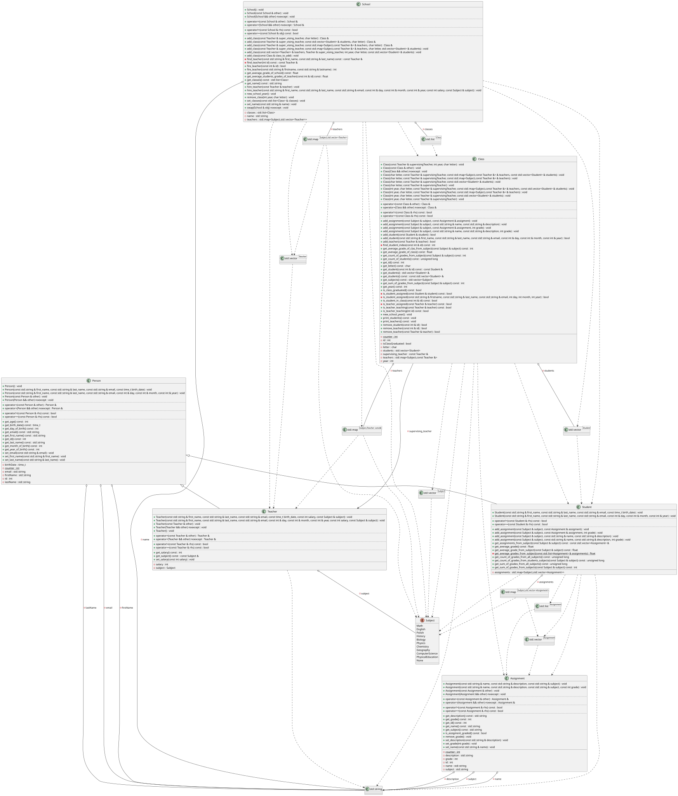

# Final Project Report: Architectural Evolution

## Introduction and Initial Design Paradigm

The preliminary project design laid a strong foundation for managing school-related entities such as students, teachers, classes, and subjects. The initial ideation proposed a structured, object-oriented approach where core entities were clearly defined. However, as with many software engineering projects, practical implementation revealed areas where the preliminary architectural choices could be optimized for better scalability, maintainability, and ease of use.

One of the most significant design decisions in the preliminary phase was the approach to storing and managing subjects. The original concept dictated that each subject (e.g., Mathematics, Physics, History) should be represented and stored as a completely separated vector within the core management classes. While conceptually simple and straightforward to implement initially, this design paradigm presented several critical drawbacks as the complexity of the project increased.

## The Problem with Hardcoded Separated Vectors

Storing each subject in its own dedicated, hardcoded vector led to a rigid architecture. The primary issues encountered were:

1. **Code Duplication and Boilerplate:** Every time a new subject needed to be added to the curriculum, the underlying class structures had to be modified. This involved declaring a new vector, creating dedicated getter and setter methods, and writing new iteration logic specifically for that vector. This resulted in an explosion of boilerplate code.
2. **Lack of Extensibility:** In a real-world scenario, a school's curriculum is dynamic. Hardcoding subjects as separate data structures violated the Open/Closed Principle (software entities should be open for extension, but closed for modification). Adding a new subject required modifying existing, tested code across multiple places, increasing the risk of introducing bugs.
3. **Complex Iteration and Operations:** Performing aggregate operations—such as calculating a student's overall GPA across all subjects, or printing a comprehensive report card—required writing custom logic that manually accessed each individual vector. If a subject was added or removed, all these aggregate functions had to be manually updated accordingly.

## Transition to a Map of Vectors

To overcome these significant limitations and future-proof the application, a major architectural refactoring was undertaken. The core change involved abandoning the isolated, hardcoded vectors in favor of a unified associative container: a Map of vectors (`std::map`).

In this new paradigm, the system utilizes a `std::map` where the keys are the subjects (defined by an enum) and the values are the corresponding vectors of subject data.

### Key Advantages and Quality of Life Improvements

The transition to a map-based storage mechanism yielded profound improvements across the entire codebase:

#### 1. Unprecedented Extensibility (Adding New Subjects)
The most immediate benefit is the ease with which the system can be extended. Adding a new subject no longer requires modifying class definitions, adding new member variables, or changing iteration logic. Now, to add a new subject, a developer simply needs to:
- Add the new subject's name to the `enum Subjects`.
- Add the corresponding text representation to the custom `to_string` function.

That is it! There are absolutely zero logic changes required anywhere else in the application. The map dynamically handles the new enum value.

#### 2. Streamlined and Generic Codebase
The codebase is now significantly cleaner and more generic. Operations that previously required hardcoded, subject-specific loops can now be handled with generic iterators over the map. For example, generating a student's transcript involves a single generic loop that processes every subject currently defined in the map, reducing code duplication and vastly improving readability.

#### 3. Enhanced Maintainability
By centralizing the storage of subject vectors into a single map, the surface area for potential bugs is drastically reduced. Updates to how subject data is processed only need to be made in one place—the generic map iteration logic—rather than being scattered across numerous subject-specific methods.

#### 4. Quality of Life Updates for Developers
From a developer's perspective, this change represents a massive "quality of life" improvement. Working with the API is now highly intuitive. Data manipulation is streamlined, and the cognitive load required to understand or extend the subject management system has been minimized.

## Conclusion on Architectural Changes

The shift from hardcoded, separated vectors to a unified map of vectors was a pivotal evolutionary step for this project. It transformed a rigid system into a highly dynamic and extensible object-oriented architecture. The resulting codebase is more robust, infinitely easier to maintain, and completely eliminates the friction associated with expanding the curriculum.


## Architecture Diagram




## Appendix: Core Header Files

The following section contains the cleaned header files (with multi-line comments removed for brevity) that form the structural backbone of the updated architecture.

```cpp
// === Assignment.h ===

//
// Created by olidiaks on 4/16/26.
//

#ifndef PROJECT_ASSIGMENT_H
#define PROJECT_ASSIGMENT_H
#include <ostream>
#include <string>


class Assignment {
private:
    int id;
    std::string name;
    std::string description;
    std::string subject;
    int grade;
    static int counter;


public:

    
    Assignment(const std::string &name, const std::string &description, const std::string &subject);

    
    Assignment(const std::string &name, const std::string &description, const std::string &subject, const int grade);

    
    Assignment(const Assignment &other);

    
    Assignment(Assignment &&other) noexcept;

    
    Assignment & operator=(const Assignment &other);

    
    Assignment & operator=(Assignment &&other) noexcept;

    
    [[nodiscard]] int get_id() const;

    
    [[nodiscard]] std::string get_subject() const;

    
    [[nodiscard]] std::string get_name() const;

    
    void set_name(const std::string &name);

    
    [[nodiscard]] std::string get_description() const;

    
    void set_description(const std::string &description);

    
    [[nodiscard]] int get_grade() const;

    
    void set_grade(int grade);

    
    void remove_grade();

    
    [[nodiscard]] bool is_assigment_graded() const;

    
    bool operator==(const Assignment &rhs) const;

    
    bool operator!=(const Assignment &rhs) const;

    
    friend std::ostream & operator<<(std::ostream &os, const Assignment &obj);

    
    friend void swap(Assignment &lhs, Assignment &rhs) noexcept;

};


#endif //PROJECT_ASSIGMENT_H

// === Class.h ===

//
// Created by olidiaks on 10.04.2026.
//

#ifndef PROJECT_CLASS_H
#define PROJECT_CLASS_H
#include <vector>
#include <ostream>

#include "Student.h"
#include "Teacher.h"


class Class {
private:
    int id;
    std::map<Subject,const Teacher&> teachers;
    std::vector<Student> students;
    const Teacher &supervising_teacher;
    static int counter;

    bool isClassGraduated;
    int year;
    char letter;

    
    [[nodiscard]] bool is_teacher_assigned(const Teacher &teacher) const;

    
    [[nodiscard]] bool is_student_assigned(const Student &student) const;

    
    bool is_student_assigned(const std::string & firstname, const std::string & last_name, const std::string & email, int day, int month, int year);

    
    int find_student_index(const int &id) const;

public:
    
    Class(const Teacher & supervisingTeacher,int year, char letter);

    
    Class(const Class &other);

    
    Class(Class &&other) noexcept;

    
    Class(char letter, const Teacher & supervisingTeacher, const std::map<Subject,const Teacher&> & teachers, const std::vector<Student> & students);

    
    Class(char letter, const Teacher & supervisingTeacher, const std::map<Subject,const Teacher&> & teachers);

    
    Class(char letter, const Teacher & supervisingTeacher, const std::vector<Student> & students);

    
    Class(char letter, const Teacher & supervisingTeacher);

    
    Class(int year, char letter, const Teacher & supervisingTeacher, const std::map<Subject,const Teacher&> & teachers, const std::vector<Student> & students);

    
    Class(int year, char letter, const Teacher & supervisingTeacher, const std::map<Subject,const Teacher&> & teachers);

    
    Class(int year, char letter, const Teacher & supervisingTeacher, const std::vector<Student> & students);

    
    Class(int year, char letter, const Teacher & supervisingTeacher);

    
    Class & operator=(const Class &other);

    
    Class & operator=(Class &&other) noexcept;

    
    [[nodiscard]] bool is_class_graduated() const;

    
    [[nodiscard]] int get_year() const;

    
    [[nodiscard]] char get_letter() const;

    
    bool add_student(const Student &student);

        
    bool add_student(const std::string &first_name, const std::string &last_name, const std::string &email,
                     const int &day, const int &month, const int &year);

    
    bool remove_student(const int &id);

    
    [[nodiscard]] bool is_student_in_class(const int &id) const;

    
    void print_students() const;

    
    void print_teachers() const;

    
    const Student &get_student(const int &id) const;

    
    std::vector<Student> &get_students();

    
    const std::vector<Student> &get_students() const;

    
    [[nodiscard]] int get_average_grade_of_clas_from_subject(const Subject &subject) const;

    
      bool operator==(const Class &rhs) const;

    
    bool operator!=(const Class &rhs) const;

    
    friend std::ostream & operator<<(std::ostream &os, const Class &obj);

    
    friend void swap(Class &lhs, Class &rhs) noexcept;

    
    [[nodiscard]] int get_id() const;

    
    [[nodiscard]] unsigned long get_count_of_students() const;

    
    [[nodiscard]] int get_sum_of_grades_from_subject(const Subject &subject) const;

    
    [[nodiscard]] int get_count_of_grades_from_subject(const Subject &subject) const;

    
    [[nodiscard]] float get_average_grade_of_class() const;

    
    void add_assignment(const Subject &subject, const Assignment &assigment);

    
    void add_assignment(const Subject &subject, const std::string &name, const std::string &description);

    
    void add_assignment(const Subject &subject, const Assignment &assignment, int grade);

    
    void add_assignment(const Subject &subject, const std::string &name, const std::string &description, int grade);

    
    bool add_teacher(const Teacher &teacher);

    
    bool remove_teacher(const int &id);

    bool remove_teacher(const Teacher &teacher);

    
    void new_school_year();

    
    [[nodiscard]] std::vector<Subject> get_subjects() const;

    
    bool is_teacher_teaching(const Teacher & teacher) const;

    
    bool is_teacher_teaching(int id) const;
};


std::ostream & operator<<(std::ostream & os, const std::vector<Student> & students);


std::ostream & operator<<(std::ostream & os, const std::list<Class> & classes);


std::ostream & operator<<(std::ostream & os, const std::vector<Teacher> & vector);


std::ostream & operator<<(std::ostream & os, const std::map<Subject,const Teacher&> & map);


#endif //PROJECT_CLASS_H

// === Person.h ===

#ifndef PROJECT_PERSON_H
#define PROJECT_PERSON_H
#include <ostream>
#include <string>


class Person {
private:
    int id; ///< A unique integer identifier assigned to each person upon creation. Defaults to -1 if uninitialized.
    std::string firstName; ///< The given name of the individual.
    std::string lastName; ///< The family name or surname of the individual.
    std::string email; ///< The primary contact email address.
    time_t birthDate; ///< The person's date of birth, stored as seconds since the Unix Epoch (Jan 1, 1970).
    static int counter; ///< A shared static counter used to ensure each Person instance receives a unique, incrementing ID.

public:
    
    Person();

    
    Person(const std::string &first_name, const std::string &last_name, const std::string &email,
           const time_t birth_date);

    
    Person(const std::string &first_name, const std::string &last_name, const std::string &email, const int &day, const int &month, const int &year);

    
    [[nodiscard]] std::string get_first_name() const;

    
    void set_first_name(const std::string &first_name);

    
    [[nodiscard]] std::string get_last_name() const;

    
    void set_last_name(const std::string &last_name);

    
    [[nodiscard]] int get_id() const;

    
    [[nodiscard]] time_t get_birth_date() const;

    
    [[nodiscard]] int get_age() const;

    
    [[nodiscard]] int get_day_of_birth() const;

    
    [[nodiscard]] int get_month_of_birth() const;

    
    [[nodiscard]] int get_year_of_birth() const;

    
    [[nodiscard]] std::string get_email() const;

    
    void set_email(const std::string &email);

    
    bool operator==(const Person &rhs) const;

    
    bool operator!=(const Person &rhs) const;

    
    friend std::ostream & operator<<(std::ostream &os, const Person &obj);

    
    Person(const Person &other);

    
    Person(Person &&other) noexcept;

    
    Person & operator=(const Person &other);

    
    Person & operator=(Person &&other) noexcept;
};


#endif //PROJECT_PERSON_H

// === School.h ===

//
// Created by olidiaks on 10.04.2026.
//

#ifndef PROJECT_SCHOOL_H
#define PROJECT_SCHOOL_H
#include <list>
#include <ostream>

#include "Class.h"
#include "Teacher.h"


class School {
private:
    std::map<Subject, std::vector<Teacher>> teachers;
    std::list<Class> classes;
    std::string name;

    
    [[nodiscard]] const Teacher &find_teacher(int id) const;

    
    [[nodiscard]] const Teacher &find_teacher(const std::string &first_name, const std::string &last_name) const;

    
public:
    School();

    
    School(const School &other);

    
    School(School &&other) noexcept;

    
    School &operator=(const School &other);

    
    School &operator=(School &&other) noexcept;

    
    bool operator==(const School &obj) const;

    
    bool operator!=(const School &rhs) const;

    
 friend std::ostream & operator<<(std::ostream &os, const School &obj);

    
    void swap(School &obj) noexcept;

    
    [[nodiscard]] std::list<Class> &get_classes();

    
    void set_classes(const std::list<Class> &classes);

    
    [[nodiscard]] float get_average_students_grades_of_teacher(const int &id) const;

    
    [[nodiscard]] float get_average_grade_of_school() const;

    
    [[nodiscard]] std::string get_name() const;

    
    void set_name(const std::string &name);

    
    void new_school_year();

    
    void add_class(const Class &class_to_add);

    
    void add_class(const std::vector<Teacher> &teachers,
                   Teacher &super_vising_teacher, int year, char letter, const std::vector<Student> &students);

    
    void add_class(const Teacher & super_vising_teacher, const std::map<Subject, const Teacher &> &teachers, char letter, std::vector<Student> &students);

    
    Class &add_class(const Teacher &super_vising_teacher, const std::map<Subject, const Teacher &> &teachers, char letter);

    
    Class &add_class(const Teacher &super_vising_teacher, const std::vector<Student> &students, char letter);

    
    Class &add_class(const Teacher &super_vising_teacher, char letter);

    
    void remove_class(int year, char letter);

    
    void hire_teacher(const Teacher &teacher);

    
    void hire_teacher(const std::string &first_name, const std::string &last_name, const std::string &email,
                      const int &day, const int &month, const int &year, const int salary, const Subject &subject);

    
    bool fire_teacher(const int &id);

    
    int fire_teacher(const std::string &firstname, const std::string &lastname);
};

std::ostream & operator<<(std::ostream & os, const std::map<Subject, std::vector<Teacher>> & map);

#endif //PROJECT_SCHOOL_H

// === Student.h ===

//
// Created by olidiaks on 10.04.2026.
//

#ifndef PROJECT_STUDENT_H
#define PROJECT_STUDENT_H

#include <list>
#include <map>
#include <ostream>
#include <vector>

#include "Assignment.h"
#include "Person.h"
#include "Subject.h"


std::ostream & operator<<(std::ostream & os, const std::vector<Assignment> & assignment_list);


class Student : public Person {
private:
    std::map<Subject, std::vector<Assignment>> assignments;

    
    [[nodiscard]] static float get_average_grades_from_subject(const std::list<Assignment> &assignments);

    
public:
    Student(const std::string &first_name, const std::string &last_name, const std::string &email,
            const time_t birth_date);

    
    Student(const std::string &first_name, const std::string &last_name, const std::string &email,
            const int &day, const int &month, const int &year);

    
    [[nodiscard]] float get_average_grade() const;

    
    [[nodiscard]] int get_sum_of_grades_from_subjects(const Subject &subject) const;

    
    [[nodiscard]] unsigned long get_count_of_grades_from_students_subjects(const Subject &subject) const;

    
    [[nodiscard]] float get_average_grade_from_subject(const Subject &subject) const;

    
    void add_assignment(const Subject &subject, const Assignment &assigment);

    
    void add_assignment(const Subject &subject, const Assignment &assignment, int grade);

    
    void add_assignment(const Subject &subject, const std::string &name, const std::string &description);

    
    void add_assignment(const Subject &subject, const std::string &name, const std::string &description, int grade);

    
    bool operator==(const Student &rhs) const;

    
    bool operator!=(const Student &rhs) const;

    
    friend std::ostream & operator<<(std::ostream &os, const Student &obj);

    
    [[nodiscard]] const std::vector<Assignment> & get_assignments_from_subject(const Subject &subject) const;

    
    unsigned long get_count_of_grades_from_all_subjects() const;

    
    unsigned long get_sum_of_grades_from_all_subjects() const;
};


#endif //PROJECT_STUDENT_H

// === Subject.h ===

//
// Created by olidiaks on 4/21/26.
//

#ifndef EOOP_SCHOOL_PROJECT_SUBJECT_H
#define EOOP_SCHOOL_PROJECT_SUBJECT_H
#include <ostream>


enum class Subject {
    Math,
    English,
    Polish,
    History,
    Biology,
    Physics,
    Chemistry,
    Geography,
    ComputerScience,
    PhysicalEducation,
    None,
};


const char *to_string(Subject e);


std::ostream & operator<<(std::ostream &os, Subject subject);


#endif //EOOP_SCHOOL_PROJECT_SUBJECT_H

// === Teacher.h ===

//
// Created by olidiaks on 10.04.2026.
//

#ifndef PROJECT_TEACHER_H
#define PROJECT_TEACHER_H
#include <ostream>
#include <string>

#include "Person.h"
#include "Student.h"


class Teacher : public Person {
private:
    int salary;
    Subject subject;

public:


    friend std::ostream & operator<<(std::ostream &os, const Teacher &obj);

    
    bool operator==(const Teacher &rhs) const;

    
    bool operator!=(const Teacher &rhs) const;

    
    Teacher(const std::string &first_name, const std::string &last_name, const std::string &email,
            const time_t birth_date, const int salary, const Subject &subject);

    
    Teacher(const std::string &first_name, const std::string &last_name, const std::string &email,
            const int &day, const int &month, const int &year, const int salary, const Subject &subject);

    
    [[nodiscard]] const Subject & get_subject() const;

    
    [[nodiscard]] int get_salary() const;

    
    void set_salary(const int salary);

    
    Teacher(const Teacher &other);

    
    Teacher(Teacher &&other) noexcept;

    
    Teacher & operator=(const Teacher &other);

    
    Teacher & operator=(Teacher &&other) noexcept;

    
    Teacher();

    
    friend void swap(Teacher &lhs, Teacher &rhs) noexcept;
};


std::ostream & operator<<(std::ostream &os, const std::list<Teacher> & Teacher);


#endif //PROJECT_TEACHER_H

```
