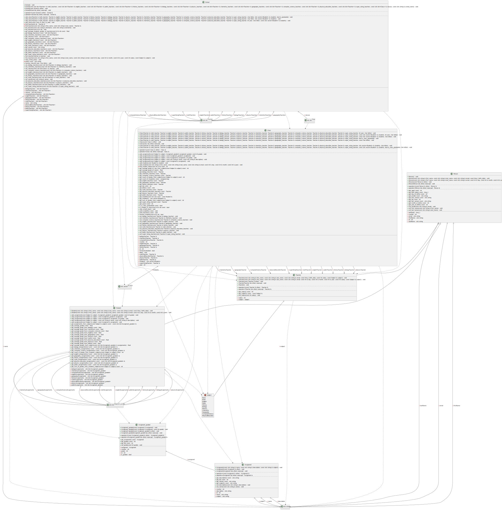

# Keyword
School

# The Story
School is a place where students are tough.
For administrative limits and for students' ability to create social relations.
Students will be organized in classes.
Each class should have a maximum 25 students 
to be able to focus in time of a lesson.
Also, to be able to create a class, each class shall
connect at least seven students.
Because it’s important that young people
know how to solve accumulation problems.
That's why students can’t be moved between classes,
so they should solve their issues with friends.
Each class should need to have teachers to teach subjects like:
- Math
- English
- Polish
- History
- Biology
- Physics
- Chemistry
- Geography
- Computer Science
- Physical Education
- Supervising teacher

Each teacher can only teach one subject because each subject is so complex that noone would be able to teach two subjects and do it correctly.
Each subject only should be though by the same teacher because changing teacher breaks the continuity of present knowledge and way of teaching.
Also, because it’s so hard, any teacher won’t be able to teach another subject than already taught. 
Each teacher can’t teach more than five classes at the same time. 
Of course, teachers and students need to be able to communicate somehow.
Communication in this school is done via email.
Each student should have one final numerical grade from each subject, which will be the final grade as required by law.
Also, for rankings school need to be able to know what the average grade in each class is.
What average grade has each teacher, and what’s the average grade school?


Also, school needs to be able to present spending on each class, and teacher.



Assigemn.h
```c++
//
// Created by olidiaks on 4/16/26.
//

#ifndef PROJECT_ASSIGMENT_H
#define PROJECT_ASSIGMENT_H
#include <ostream>
#include <string>


/**
 * @class Assignment
 * @brief Represents a task or work assigned to a person or group, typically for evaluation or completion purposes.
 *
 * The Assignment class is designed to encapsulate the details related to an assignment,
 * such as its attributes, behavior, and potential operations that can be performed
 * on it. This class serves as a model or blueprint for assignments in various contexts,
 * such as educational institutions, work environments, or projects.
 *
 * Responsibilities of this class may include managing the assignment's state,
 * facilitating interactions with its data, and providing utility methods relevant
 * to assignments.
 */
class Assigment {
private:
    int id;
    std::string name;
    std::string description;
    std::string subject;
    static int counter;

    /**
     * @brief Constructs a new Assigment object with the provided name, description, and subject.
     *
     * The constructor initializes a new instance of the Assigment class using the given parameters.
     * Each new instance is assigned a unique ID, which is generated using a static counter.
     *
     * @param name The name of the assignment.
     * @param description A detailed description of the assignment.
     * @param subject The subject associated with the assignment.
     * @return A new instance of the Assigment class.
     */
public:
    Assigment(const std::string &name, const std::string &description, const std::string &subject);

    /**
     * @brief Copy constructor for the Assigment class.
     *
     * Creates a new instance of the Assigment class by copying the attributes
     * from another existing Assigment object. This constructor ensures that all
     * attributes of the source object, such as its ID, name, description, and subject,
     * are copied into the new instance.
     *
     * @param other The Assigment object to copy from.
     * @return A new Assigment instance with the same attribute values as the provided object.
     */
    Assigment(const Assigment &other);

    /**
     * @class Assignment
     * @brief Encapsulates the details and operations related to a specific task or duty assigned to individuals or groups.
     *
     * The Assignment class serves as a representation of tasks or responsibilities that need
     * to be completed, typically within a defined context such as academic, professional,
     * or collaborative environments. It provides a structure to manage and manipulate
     * assignment-specific data and behavior.
     *
     * This class is designed to support features that allow for tracking, evaluating, and managing
     * the lifecycle of an assignment, from creation to completion.
     */
    Assigment(Assigment &&other) noexcept;

    /**
     * @brief Copy assignment operator for the Assigment class.
     *
     * Assigns the contents of another Assigment object to this object,
     * replacing the existing values with those from the provided object.
     * All attributes, such as ID, name, description, and subject, are copied
     * to ensure the two objects have identical data content.
     *
     * This operator handles self-assignment checks and ensures the integrity
     * of the object's state during the assignment operation.
     *
     * @param other The Assigment object to copy from.
     * @return A reference to this Assigment object, with updated attribute values.
     */
    Assigment & operator=(const Assigment &other);

    /**
     * @brief Move assignment operator for the Assigment class.
     *
     * Transfers the contents of another Assigment object to this object
     * using move semantics. This operator ensures efficient ownership
     * transfer of resources, such as dynamically allocated memory, by
     * "stealing" the data from the provided object and leaving it in a
     * valid but unspecified state.
     *
     * This operator checks for self-assignment and ensures that all attributes
     * of the source object, such as its ID, name, description, and subject,
     * are moved to the current object. After the assignment, the source
     * object is valid but no longer contains meaningful data.
     *
     * @param other The Assigment object to move from.
     * @return A reference to this Assigment object, with updated attribute values.
     */
    Assigment & operator=(Assigment &&other) noexcept;

    /**
     * @brief Retrieves the unique identifier of the assignment.
     *
     * This method returns the ID associated with the current instance
     * of the Assigment class. The ID is typically assigned during the
     * object's construction and remains immutable, serving as a unique
     * identifier for the assignment.
     *
     * @return The unique ID of the assignment.
     */
    [[nodiscard]] int get_id() const;

    /**
     * @brief Retrieves the subject associated with the assignment.
     *
     * This method provides access to the subject that the assignment
     * pertains to. The subject is typically defined when the assignment
     * is created and reflects its categorical or thematic context.
     *
     * @return The subject of the assignment as a string.
     */
    [[nodiscard]] std::string get_subject() const;

    /**
     * @brief Retrieves the name of the assignment.
     *
     * This method returns the name associated with the assignment instance.
     * The returned value is typically used to identify or reference the assignment.
     *
     * @return The name of the assignment as a string.
     */
    [[nodiscard]] std::string get_name() const;

    /**
     * @brief Sets the name of the assignment.
     *
     * This method updates the name attribute of the assignment instance
     * to the specified value.
     *
     * @param name The new name to be set for the assignment.
     */
    void set_name(const std::string &name);

    /**
     * @brief Retrieves the description of the assignment.
     *
     * This method provides access to the textual representation of the
     * assignment's description, offering details or context about the
     * specific assignment instance.
     *
     * @return A string containing the description of the assignment.
     */
    [[nodiscard]] std::string get_description() const;

    /**
     * @brief Sets the description of the assignment.
     *
     * This method allows updating the description associated with the assignment,
     * providing the ability to modify or set details about what the assignment entails.
     *
     * @param description The new description to associate with the assignment.
     */
    void set_description(const std::string &description);

    /**
     * @brief Compares two Assignment objects for equality.
     *
     * Determines whether two Assignment instances are considered equal by
     * comparing their properties such as ID, name, description, and subject.
     *
     * @param lhs The first Assignment object to compare.
     * @param rhs The second Assignment object to compare.
     * @return True if both Assignment objects are equal; otherwise, false.
     */
    friend bool operator==(const Assigment &lhs, const Assigment &rhs);

    /**
     * @brief Compares two Assignment objects for inequality.
     *
     * This operator checks if the two provided Assignment objects are not equal
     * by internally using the equality operator.
     *
     * @param lhs The left-hand side Assignment object to compare.
     * @param rhs The right-hand side Assignment object to compare.
     * @return True if the two Assignment objects are not equal, otherwise false.
     */
    friend bool operator!=(const Assigment &lhs, const Assigment &rhs);

    /**
     * @class Operator
     * @brief Represents a generic operator used to perform operations within a system, framework, or calculation.
     *
     * The Operator class models an entity or mechanism that applies a specific operation,
     * transformation, or functionality. This class can be utilized in various contexts such as
     * mathematical computations, handling user-defined behaviors, or managing logical operations.
     *
     * It is designed to define, process, and execute the intended operation while providing the
     * necessary encapsulation and abstraction. The class may also support extended or overloaded
     * functionality for different types of operations.
     */
    friend std::ostream & operator<<(std::ostream &os, const Assigment &obj);

    /**
     * @brief Exchanges the contents of two Assignment objects.
     *
     * This function performs a member-wise swap of all attributes of the provided
     * Assignment instances. The operation is performed in a no-throw manner
     * by leveraging `std::swap` for each member variable of the Assignment class.
     *
     * The function ensures that the `lhs` and `rhs` objects exchange their internal
     * states efficiently.
     *
     * @param lhs Reference to the first Assignment object to be swapped.
     * @param rhs Reference to the second Assignment object to be swapped.
     */
    friend void swap(Assigment &lhs, Assigment &rhs) noexcept;

};


#endif //PROJECT_ASSIGMENT_H

```


Class.h
```c++
//
// Created by olidiaks on 10.04.2026.
//

#ifndef PROJECT_CLASS_H
#define PROJECT_CLASS_H
#include <vector>
#include <ostream>

#include "Student.h"
#include "Teacher.h"


/**
 * @class Class
 * @brief Manages a classroom, its students, teachers, and assignments.
 */
class Class {
private:
    int id;
    Teacher &mathTeacher;
    Teacher &englishTeacher;
    Teacher &polishTeacher;
    Teacher &historyTeacher;
    Teacher &biologyTeacher;
    Teacher &physicsTeacher;
    Teacher &chemistryTeacher;
    Teacher &geographyTeacher;
    Teacher &computerScienceTeacher;
    Teacher &physicalEducationTeacher;
    Teacher &superVisingTeacher;
    std::vector<Student> students;
    static int counter;

    bool isClassGraduated;
    int year;
    char letter;

    /**
     * @brief Finds the index of a student in the class by their unique ID.
     *
     * This method iterates through the list of students, comparing the provided ID
     * with the IDs of the students in the class. If a matching ID is found, the
     * index of that student is returned. Otherwise, the method returns -1.
     *
     * @param id The unique identifier of the student to find.
     * @return The index of the student in the list if found, or -1 if no student
     *         with the given ID exists.
     */
    int find_student_index(const int &id) const;

    /**
     * @brief Constructs a Class object with a full set of teachers, year, and letter designation.
     *
     * Initializes the Class object with the provided teachers for different subjects,
     * along with the academic year and letter designation. Also assigns a unique ID
     * to the class and initializes it as not graduated.
     *
     * @param math_teacher The teacher responsible for mathematics.
     * @param english_teacher The teacher responsible for English.
     * @param polish_teacher The teacher responsible for Polish.
     * @param history_teacher The teacher responsible for history.
     * @param biology_teacher The teacher responsible for biology.
     * @param physics_teacher The teacher responsible for physics.
     * @param chemistry_teacher The teacher responsible for chemistry.
     * @param geography_teacher The teacher responsible for geography.
     * @param computer_science_teacher The teacher responsible for computer science.
     * @param physical_education_teacher The teacher responsible for physical education.
     * @param super_vising_teacher The teacher assigned as the supervising teacher for the class.
     * @param year The year the class belongs to.
     * @param letter The letter designation of the class.
     */
public:
    Class(Teacher &math_teacher, Teacher &english_teacher, Teacher &polish_teacher,
        Teacher &history_teacher, Teacher &biology_teacher, Teacher &physics_teacher, Teacher &chemistry_teacher,
        Teacher &geography_teacher, Teacher &computer_science_teacher, Teacher &physical_education_teacher,
        Teacher &super_vising_teacher, int year, char letter);

    /**
     * @brief Constructs a Class object with assigned teachers, students, year, and letter.
     *
     * @param math_teacher Reference to the math teacher for the class.
     * @param english_teacher Reference to the English teacher for the class.
     * @param polish_teacher Reference to the Polish teacher for the class.
     * @param history_teacher Reference to the history teacher for the class.
     * @param biology_teacher Reference to the biology teacher for the class.
     * @param physics_teacher Reference to the physics teacher for the class.
     * @param chemistry_teacher Reference to the chemistry teacher for the class.
     * @param geography_teacher Reference to the geography teacher for the class.
     * @param computer_science_teacher Reference to the computer science teacher for the class.
     * @param physical_education_teacher Reference to the physical education teacher for the class.
     * @param super_vising_teacher Reference to the supervising teacher responsible for the class.
     * @param students Vector containing the list of students in the class.
     * @param year The academic year of the class.
     * @param letter The letter identifier for the class (e.g., 'A', 'B').
     */
    Class(Teacher &math_teacher, Teacher &english_teacher, Teacher &polish_teacher, Teacher &history_teacher,
          Teacher &biology_teacher, Teacher &physics_teacher, Teacher &chemistry_teacher, Teacher &geography_teacher,
          Teacher &computer_science_teacher, Teacher &physical_education_teacher, Teacher &super_vising_teacher,
          const std::vector<Student> &students, int year, char letter);

    /**
     * @brief Constructs a new Class object with the specified teachers, students, and class identifier.
     *
     * @param math_teacher Reference to the math teacher assigned to the class.
     * @param english_teacher Reference to the English teacher assigned to the class.
     * @param polish_teacher Reference to the Polish teacher assigned to the class.
     * @param history_teacher Reference to the history teacher assigned to the class.
     * @param biology_teacher Reference to the biology teacher assigned to the class.
     * @param physics_teacher Reference to the physics teacher assigned to the class.
     * @param chemistry_teacher Reference to the chemistry teacher assigned to the class.
     * @param geography_teacher Reference to the geography teacher assigned to the class.
     * @param computer_science_teacher Reference to the computer science teacher assigned to the class.
     * @param physical_education_teacher Reference to the physical education teacher assigned to the class.
     * @param super_vising_teacher Reference to the supervising teacher assigned to the class.
     * @param students Vector of students assigned to this class.
     * @param letter The identifying letter for the class (e.g., 'A', 'B').
     */
    Class(Teacher &math_teacher, Teacher &english_teacher, Teacher &polish_teacher, Teacher &history_teacher,
          Teacher &biology_teacher, Teacher &physics_teacher, Teacher &chemistry_teacher, Teacher &geography_teacher,
          Teacher &computer_science_teacher, Teacher &physical_education_teacher, Teacher &super_vising_teacher,
          const std::vector<Student> &students, char letter);

    /**
     * @brief Constructs a Class object with specified teachers and graduation status.
     *
     * @param math_teacher The teacher responsible for teaching mathematics.
     * @param english_teacher The teacher responsible for teaching English.
     * @param polish_teacher The teacher responsible for teaching Polish.
     * @param history_teacher The teacher responsible for teaching history.
     * @param biology_teacher The teacher responsible for teaching biology.
     * @param physics_teacher The teacher responsible for teaching physics.
     * @param chemistry_teacher The teacher responsible for teaching chemistry.
     * @param geography_teacher The teacher responsible for teaching geography.
     * @param computer_science_teacher The teacher responsible for teaching computer science.
     * @param physical_education_teacher The teacher responsible for teaching physical education.
     * @param super_vising_teacher The teacher responsible for supervising the class.
     * @param is_class_graduated Indicates whether the class has graduated.
     */
    Class(Teacher &math_teacher, Teacher &english_teacher, Teacher &polish_teacher, Teacher &history_teacher,
          Teacher &biology_teacher, Teacher &physics_teacher, Teacher &chemistry_teacher, Teacher &geography_teacher,
          Teacher &computer_science_teacher, Teacher &physical_education_teacher, Teacher &super_vising_teacher,
          bool is_class_graduated);

    /**
     * @brief Constructs a Class object with associated teachers and a class identifier.
     *
     * This constructor initializes a Class instance by assigning the provided teachers to their respective subjects
     * and setting the class's letter identifier. It also initializes the class's ID, sets its year to 1, and marks it as not graduated.
     *
     * @param math_teacher Reference to the teacher responsible for math.
     * @param english_teacher Reference to the teacher responsible for English.
     * @param polish_teacher Reference to the teacher responsible for Polish.
     * @param history_teacher Reference to the teacher responsible for history.
     * @param biology_teacher Reference to the teacher responsible for biology.
     * @param physics_teacher Reference to the teacher responsible for physics.
     * @param chemistry_teacher Reference to the teacher responsible for chemistry.
     * @param geography_teacher Reference to the teacher responsible for geography.
     * @param computer_science_teacher Reference to the teacher responsible for computer science.
     * @param physical_education_teacher Reference to the teacher responsible for physical education.
     * @param super_vising_teacher Reference to the teacher responsible for supervising the class.
     * @param letter Character denoting the class's unique letter identifier.
     */
    Class(Teacher &math_teacher, Teacher &english_teacher, Teacher &polish_teacher, Teacher &history_teacher,
          Teacher &biology_teacher, Teacher &physics_teacher, Teacher &chemistry_teacher, Teacher &geography_teacher,
          Teacher &computer_science_teacher, Teacher &physical_education_teacher, Teacher &super_vising_teacher,
          const char letter);

    /**
     * @brief Copy constructor for the Class object.
     *
     * Creates a new instance of the Class object by performing a deep copy
     * of the provided Class instance.
     *
     * @param other The Class instance to copy from.
     * @return A new Class object initialized with the values from the provided object.
     */
    Class(const Class &other);

    /**
     * @brief Move constructor for the Class object.
     *
     * Transfers ownership of the resources and state from the given object to this instance.
     *
     * @param other The Class object to be moved from. After the operation, the `other` object
     *              may no longer be in a valid state.
     */
    Class(Class &&other) noexcept;

    /**
     * @brief Constructs a new Class object with assigned teachers, students, and a class letter.
     *
     * @param math_teacher              Reference to the math teacher assigned to the class.
     * @param english_teacher           Reference to the English teacher assigned to the class.
     * @param polish_teacher            Reference to the Polish teacher assigned to the class.
     * @param history_teacher           Reference to the history teacher assigned to the class.
     * @param biology_teacher           Reference to the biology teacher assigned to the class.
     * @param physics_teacher           Reference to the physics teacher assigned to the class.
     * @param chemistry_teacher         Reference to the chemistry teacher assigned to the class.
     * @param geography_teacher         Reference to the geography teacher assigned to the class.
     * @param computer_science_teacher  Reference to the computer science teacher assigned to the class.
     * @param physical_education_teacher Reference to the physical education teacher assigned to the class.
     * @param super_vising_teacher      Reference to the supervising teacher assigned to manage the class.
     * @param students                  Reference to a vector containing the list of students in the class.
     * @param letter                    Character representing the letter identifier of the class.
     *
     * @return A newly constructed Class object.
     */
    Class( Teacher & math_teacher,  Teacher & english_teacher,  Teacher & polish_teacher,  Teacher & history_teacher,  Teacher & biology_teacher,  Teacher & physics_teacher,  Teacher & chemistry_teacher,
           Teacher & geography_teacher,  Teacher & computer_science_teacher,  Teacher & physical_education_teacher,  Teacher & super_vising_teacher,  std::vector<Student> & students, char letter);

    /**
     * @brief Constructs an instance of the Class object with specified teachers, students, graduation status, and identifier.
     *
     * @param math_teacher Reference to the assigned math teacher.
     * @param english_teacher Reference to the assigned English teacher.
     * @param polish_teacher Reference to the assigned Polish teacher.
     * @param history_teacher Reference to the assigned history teacher.
     * @param biology_teacher Reference to the assigned biology teacher.
     * @param physics_teacher Reference to the assigned physics teacher.
     * @param chemistry_teacher Reference to the assigned chemistry teacher.
     * @param geography_teacher Reference to the assigned geography teacher.
     * @param computer_science_teacher Reference to the assigned computer science teacher.
     * @param physical_education_teacher Reference to the assigned physical education teacher.
     * @param super_vising_teacher Reference to the supervising teacher of the class.
     * @param students List of students in the class.
     * @param is_class_graduated Indicates whether the class has graduated.
     * @param letter The letter identifier of the class.
     *
     * @return None.
     */
    Class(Teacher &math_teacher, Teacher &english_teacher, Teacher &polish_teacher, Teacher &history_teacher,
          Teacher &biology_teacher, Teacher &physics_teacher, Teacher &chemistry_teacher, Teacher &geography_teacher,
          Teacher &computer_science_teacher, Teacher &physical_education_teacher, Teacher &super_vising_teacher,
          const std::vector<Student> &students, bool is_class_graduated, char letter);

    /**
     * @brief Overloads the assignment operator for the Class object.
     *        Copies all attributes from the given Class object into this object.
     *
     * @param other The Class object from which data will be copied.
     * @return A reference to this Class object after assignment.
     */
    Class & operator=(const Class &other);

    /**
     * @brief Move assignment operator for the Class class.
     *
     * Transfers ownership of all members from another Class instance to this instance,
     * effectively moving its state while ensuring proper resource management.
     *
     * @param other The Class instance to move from.
     * @return A reference to the current Class instance after the assignment.
     */
    Class & operator=(Class &&other) noexcept;

    /**
     * @brief Checks if the class has graduated.
     * @return True if the class has graduated, false otherwise.
     */
    [[nodiscard]] bool is_is_class_graduated() const;

    /**
     * @brief Retrieves the year associated with the class.
     * @return The year of the class as an integer.
     */
    [[nodiscard]] int get_year() const;

    /**
     * @brief Retrieves the letter associated with the class.
     * @return The letter representing the class.
     */
    [[nodiscard]] char get_letter() const;

    /**
     * @brief Adds a student to the class.
     * @param student The student to be added to the class.
     */
    void add_student(const Student &student);

    /**
     * @brief Adds a new student to the class roster.
     *
     * @param first_name The first name of the student.
     * @param last_name The last name of the student.
     * @param email The email address of the student.
     * @param day The day of the student's birth date.
     * @param month The month of the student's birth date.
     * @param year The year of the student's birth date.
     */
    void add_student(const std::string &first_name, const std::string &last_name, const std::string &email,
                     const int &day, const int &month, const int &year);

    /**
     * @brief Removes a student from the class based on their unique ID.
     * @param id The unique identifier of the student to be removed.
     * @return True if the student was found and successfully removed, false otherwise.
     */
    bool remove_student(const int &id);

    /**
     * @brief Checks if a student with the given ID is in the class.
     * @param id The ID of the student to search for.
     * @return True if the student is in the class, false otherwise.
     */
    [[nodiscard]] bool is_student_in_class(const int &id) const;

    /**
     * @brief Outputs the list of students to the standard output.
     *
     * This method retrieves and displays the list of students
     * managed by the class.
     */
    void print_students() const;

    /**
     * @brief Outputs the list of teachers associated with the class.
     *
     * This method prints the names of all teachers for various subjects
     * and the supervising teacher to the standard output.
     * It provides an overview of all teaching staff assigned to the class
     * along with their roles.
     */
    void print_teachers() const;

    /**
     * @brief Retrieves a student by their unique identifier.
     * @param id The unique identifier of the student to retrieve.
     * @return A constant reference to the student associated with the given identifier.
     * @throws std::runtime_error If no student with the specified identifier is found.
     */
    const Student &get_student(const int &id) const;

    /**
     * @brief Retrieves the list of students associated with the class.
     * @return A reference to a vector containing the students in the class.
     */
    std::vector<Student> &get_students();

    /**
     * @brief Calculates the average grade of the class for a given subject.
     * @param subject The subject for which the average grade is calculated.
     * @return The average grade for the specified subject. Returns 0 if no grades are available.
     */
    [[nodiscard]] int get_average_grade_of_clas_from_subject(const Subject &subject) const;

    /**
     * @brief Compares two Class objects for equality.
     *
     * This operator checks whether two Class objects are equal by comparing all of their properties
     * including their students, identifiers, teachers of various subjects, graduation status, and
     * class year information.
     *
     * @param lhs The first Class object to compare.
     * @param rhs The second Class object to compare.
     * @return true if the two Class objects are equivalent; false otherwise.
     */
    friend bool operator==(const Class &lhs, const Class &rhs);

    /**
     * @brief Compares two Class objects for inequality.
     *
     * This operator checks if two Class objects are not equivalent
     * by negating the result of the equality comparison between them.
     *
     * @param lhs The first Class object to compare.
     * @param rhs The second Class object to compare.
     * @return True if the objects are not equal, otherwise false.
     */
    friend bool operator!=(const Class &lhs, const Class &rhs);

    /**
     * @brief Overloads the stream insertion operator to output the details of a Class object.
     *
     * This function provides a formatted representation of the Class object,
     * including its identifier, year, letter, graduation status, teachers, and student details.
     *
     * @param os The output stream to which the Class object is written.
     * @param obj A reference to the Class object to be output.
     * @return A reference to the output stream, allowing for chaining of stream operations.
     */
    friend std::ostream & operator<<(std::ostream &os, const Class &obj);

    /**
     * @brief Exchanges the contents of two Class objects.
     *
     * This function swaps all the member variables of two Class instances. It ensures
     * that all associated data, such as teachers, students, and class identifiers, are fully exchanged.
     *
     * @param lhs A reference to the first Class object.
     * @param rhs A reference to the second Class object.
     */
    friend void swap(Class &lhs, Class &rhs) noexcept;

    /**
     * @brief Retrieves the math teacher associated with the class.
     * @return The math teacher of the class.
     */
    [[nodiscard]] Teacher get_math_teacher() const;

    /**
     * @brief Sets the math teacher for the class.
     * @param math_teacher A reference to the Teacher object to be assigned as the math teacher.
     */
    void set_math_teacher(const Teacher &math_teacher);

    /**
     * @brief Retrieves the English teacher assigned to the class.
     * @return The English teacher of the class as a Teacher object.
     */
    [[nodiscard]] Teacher get_english_teacher() const;

    /**
     * @brief Sets the English teacher for the class.
     * @param english_teacher A reference to the Teacher object to be assigned as the English teacher.
     */
    void set_english_teacher(const Teacher &english_teacher);

    /**
     * @brief Retrieves the Polish teacher assigned to the class.
     * @return The Polish teacher associated with the class.
     */
    [[nodiscard]] Teacher get_polish_teacher() const;

    /**
     * @brief Sets the Polish teacher for the class.
     * @param polish_teacher The teacher to be assigned as the Polish teacher.
     */
    void set_polish_teacher(const Teacher &polish_teacher);

    /**
     * @brief Retrieves the history teacher assigned to the class.
     * @return The teacher responsible for teaching history in the class.
     */
    [[nodiscard]] Teacher get_history_teacher() const;

    /**
     * @brief Sets the history teacher for the class.
     * @param history_teacher The teacher to be assigned as the history teacher.
     */
    void set_history_teacher(const Teacher &history_teacher);

    /**
     * @brief Retrieves the biology teacher assigned to the class.
     * @return The teacher object representing the biology teacher.
     */
    [[nodiscard]] Teacher get_biology_teacher() const;

    /**
     * @brief Sets the biology teacher for the class.
     * @param biology_teacher The Teacher object representing the biology teacher to be assigned.
     */
    void set_biology_teacher(const Teacher &biology_teacher);

    /**
     * @brief Retrieves the physics teacher of the class.
     * @return The physics teacher associated with the class.
     */
    [[nodiscard]] Teacher get_physics_teacher() const;

    /**
     * @brief Assigns a physics teacher to the class.
     * @param physics_teacher The Teacher object representing the physics teacher to be assigned.
     */
    void set_physics_teacher(const Teacher &physics_teacher);

    /**
     * @brief Retrieves the chemistry teacher for the class.
     * @return The teacher assigned to chemistry for this class.
     */
    [[nodiscard]] Teacher get_chemistry_teacher() const;

    /**
     * @brief Sets the chemistry teacher for the class.
     * @param chemistry_teacher A reference to the Teacher object to be assigned as the chemistry teacher.
     */
    void set_chemistry_teacher(const Teacher &chemistry_teacher);

    /**
     * @brief Retrieves the geography teacher associated with the class.
     * @return The teacher responsible for teaching geography.
     */
    [[nodiscard]] Teacher get_geography_teacher() const;

    /**
     * @brief Sets the geography teacher for the class.
     * @param geography_teacher The teacher object to be assigned as the geography teacher.
     */
    void set_geography_teacher(const Teacher &geography_teacher);

    /**
     * @brief Retrieves the computer science teacher for the class.
     * @return The teacher assigned to computer science in the class.
     */
    [[nodiscard]] Teacher get_computer_science_teacher() const;

    /**
     * @brief Sets the computer science teacher for the class.
     * @param computer_science_teacher The Teacher object representing the computer science teacher to be assigned.
     */
    void set_computer_science_teacher(const Teacher &computer_science_teacher);

    /**
     * @brief Retrieves the physical education teacher of the class.
     * @return The teacher assigned to physical education.
     */
    [[nodiscard]] Teacher get_physical_education_teacher() const;

    /**
     * @brief Sets the physical education teacher for the class.
     * @param physical_education_teacher The teacher to assign as the physical education teacher.
     */
    void set_physical_education_teacher(const Teacher &physical_education_teacher);

    /**
     * @brief Retrieves the supervising teacher of the class.
     * @return The teacher supervising the class.
     */
    [[nodiscard]] Teacher get_super_vising_teacher() const;

    /**
     * @brief Sets the supervising teacher for the class.
     * @param super_vising_teacher A reference to the Teacher object to be assigned as the supervising teacher.
     */
    void set_super_vising_teacher(const Teacher &super_vising_teacher);

    /**
     * @brief Retrieves the unique identifier of the class.
     * @return The identifier of the class as an integer.
     */
    [[nodiscard]] int get_id() const;

    /**
     * @brief Retrieves the total number of students in the class.
     * @return The count of students as an unsigned long.
     */
    [[nodiscard]] unsigned long get_count_of_students() const;

    /**
     * @brief Calculates the total sum of grades for a given subject across all students in the class.
     * @param subject The subject for which the grades are to be summed.
     * @return The sum of all grades for the specified subject across all students.
     */
    [[nodiscard]] int get_sum_of_grades_from_subject(const Subject &subject) const;

    /**
     * @brief Calculates the total number of grades for a specific subject across all students in the class.
     * @param subject The subject for which the grades are counted.
     * @return The total count of grades for the specified subject.
     */
    [[nodiscard]] int get_count_of_grades_from_subject(const Subject &subject) const;

    /**
     * @brief Calculates the average grade of the class across all subjects and students.
     */
    [[nodiscard]] float get_average_grade_of_class();

    /**
     * @brief Assigns a new assignment to all students in the class for a specific subject.
     * @param subject The subject associated with the assignment.
     * @param assigment The assignment to be added for the subject.
     */
    void add_assignment(const Subject &subject, const Assigment &assigment);

    /**
     * @brief Adds a new assignment to all students in the class.
     * @param subject The subject associated with the assignment.
     * @param name The name of the assignment.
     * @param description A brief description of the assignment.
     */
    void add_assignment(const Subject &subject, const std::string &name, const std::string &description);

    /**
     * @brief Adds an assignment with a specified grade to all students in the class for a given subject.
     * @param subject The subject associated with the assignment.
     * @param assignment The assignment to be assigned to each student.
     * @param grade The grade to be associated with the assignment.
     */
    void add_assignment(const Subject &subject, const Assigment &assigment, int grade);

    /**
     * @brief Adds a graded assignment for all students in the class.
     * @param subject The subject associated with the assignment.
     * @param assigment The graded assignment to be added for each student.
     */
    void add_assignment(const Subject &subject, const Assigment_graded &assigment);

    /**
     * @brief Adds a graded assignment for all students in the class.
     * @param subject The subject associated with the assignment.
     * @param assigment_graded The graded assignment to be added.
     * @param grade The grade assigned to the assignment.
     */
    void add_assignment(const Subject &subject, Assigment_graded &assigment_graded, const int grade);

    /**
     * @brief Advances the class to the next school year.
     *
     * Updates the current year of the class. If the class reaches the fifth year,
     * it resets the year to an initial state and marks the class as graduated.
     */
    void new_school_year();
};

/**
 * @brief Overloads the stream insertion operator to output a list of students.
 *
 * This method writes the details of each student in the given vector to the specified
 * output stream, with each student's details separated by a newline.
 *
 * @param os The output stream to write to.
 * @param students A vector containing the students to output.
 * @return A reference to the output stream after the students have been written to it.
 */
std::ostream & operator<<(std::ostream & os, const std::vector<Student> & students);


#endif //PROJECT_CLASS_H

```

Person.h
```c++
/**
 * @file Person.h
 * @brief Header file for the Person class, providing a robust representation of an individual's personal data.
 * @author olidiaks
 * @date 4/11/26
 */

#ifndef PROJECT_PERSON_H
#define PROJECT_PERSON_H
#include <ostream>
#include <string>

/**
 * @class Person
 * @brief Represents an individual with properties such as ID, name, email, and birth date.
 *
 * Provides functionalities for setting and retrieving personal information,
 * calculating age, formatting birth dates, and comparing Person objects.
 */
class Person {
private:
    int id; ///< A unique integer identifier assigned to each person upon creation. Defaults to -1 if uninitialized.
    std::string firstName; ///< The given name of the individual.
    std::string lastName; ///< The family name or surname of the individual.
    std::string email; ///< The primary contact email address.
    time_t birthDate; ///< The person's date of birth, stored as seconds since the Unix Epoch (Jan 1, 1970).
    static int counter; ///< A shared static counter used to ensure each Person instance receives a unique, incrementing ID.

public:
    /**
     * @brief Constructs a default instance of the Person class.
     *
     * Initializes the Person object with default values for all properties.
     * The ID is set to -1, names and email are set to empty strings, and the birth date is initialized to 0.
     *
     * @return A fully constructed Person object with default property values.
     */
    Person();

    /**
     * @brief Specialized constructor using a pre-calculated time_t value for the birth date.
     * 
     * @param first_name The individual's first name.
     * @param last_name The individual's last name.
     * @param email The individual's contact email.
     * @param birth_date A time_t value representing the exact moment of birth.
     * 
     * This constructor increments the static `counter` and assigns the new value to the person's `id`.
     */
    Person(const std::string &first_name, const std::string &last_name, const std::string &email,
           const time_t birth_date);

    /**
     * @brief Overloaded constructor for initialization using human-readable date components.
     * 
     * Internally converts the day, month, and year into a `time_t` value using the `tm` structure.
     * 
     * @param first_name The individual's first name.
     * @param last_name The individual's last name.
     * @param email The individual's contact email.
     * @param day Calendar day (1-31).
     * @param month Calendar month (1-12).
     * @param year Calendar year (e.g., 1995).
     * 
     * Like other parameterized constructors, this increments the global ID counter.
     */
    Person(const std::string &first_name, const std::string &last_name, const std::string &email, const int &day, const int &month, const int &year);

    /**
     * @brief Retrieves the stored first name.
     * @return A string containing the person's first name.
     */
    [[nodiscard]] std::string get_first_name() const;

    /**
     * @brief Updates the person's first name.
     * @param first_name The new first name to be assigned.
     */
    void set_first_name(const std::string &first_name);

    /**
     * @brief Retrieves the stored last name.
     * @return A string containing the person's last name.
     */
    [[nodiscard]] std::string get_last_name() const;

    /**
     * @brief Updates the person's last name.
     * @param last_name The new last name to be assigned.
     */
    void set_last_name(const std::string &last_name);

    /**
     * @brief Retrieves the unique system identifier for this person.
     * @return An integer representing the unique ID.
     */
    [[nodiscard]] int get_id() const;

    /**
     * @brief Retrieves the full birth date as a time_t value.
     * @return The birth date in seconds since the Epoch.
     */
    [[nodiscard]] time_t get_birth_date() const;

    /**
     * @brief Calculates the person's current age based on the system time.
     * 
     * The method calculates the difference between the current time and the birth date,
     * then extracts the year component from the resulting duration.
     * 
     * @return The number of full years elapsed since the birth date.
     */
    [[nodiscard]] int get_age() const;

    /**
     * @brief Extracts the day component from the birth date.
     * @return The day of the month (1-31).
     */
    [[nodiscard]] int get_day_of_birth() const;

    /**
     * @brief Extracts the month component from the birth date.
     * @return The month of the year as an integer (1-12).
     */
    [[nodiscard]] int get_month_of_birth() const;

    /**
     * @brief Extracts the year component from the birth date.
     * @return The four-digit birth year (e.g., 2026).
     */
    [[nodiscard]] int get_year_of_birth() const;

    /**
     * @brief Retrieves the person's email address.
     * @return A string representing the email address.
     */
    [[nodiscard]] std::string get_email() const;

    /**
     * @brief Updates the person's email address.
     * @param email The new email string to validate and store.
     */
    void set_email(const std::string &email);

    /**
     * @brief Checks if two Person instances are identical across all fields.
     * 
     * @param lhs The first person to compare.
     * @param rhs The second person to compare.
     * @return True if ID, name, email, and birth date all match.
     */
    friend bool operator==(const Person &lhs, const Person &rhs);

    /**
     * @brief Checks if two Person instances differ in any field.
     * 
     * @param lhs The first person to compare.
     * @param rhs The second person to compare.
     * @return True if any attribute differs between the two objects.
     */
    friend bool operator!=(const Person &lhs, const Person &rhs);

    /**
     * @brief Formats the Person's information for output to a stream.
     * 
     * Generates a string including the ID, full name, email, age, and a 
     * formatted DD.MM.YYYY birth date.
     * 
     * @param os The output stream (e.g., std::cout or a file stream).
     * @param obj The Person instance to be serialized.
     * @return A reference to the modified output stream.
     */
    friend std::ostream & operator<<(std::ostream &os, const Person &obj);

    /**
     * @brief Copy constructor creating a new Person as a clone of an existing one.
     * @param other The source Person instance to copy data from.
     */
    Person(const Person &other);

    /**
     * @brief Move constructor for efficient transfer of resources.
     * @param other The temporary Person instance whose resources will be moved.
     */
    Person(Person &&other) noexcept;

    /**
     * @brief Copy assignment operator replacing current data with a copy of another instance.
     * @param other The source Person to copy from.
     * @return A reference to this updated instance.
     */
    Person & operator=(const Person &other);

    /**
     * @brief Move assignment operator transferring ownership of resources from another instance.
     * @param other The source Person instance to move from.
     * @return A reference to this updated instance.
     */
    Person & operator=(Person &&other) noexcept;
};


#endif //PROJECT_PERSON_H

```

School.h

```c++
//
// Created by olidiaks on 10.04.2026.
//

#ifndef PROJECT_SCHOOL_H
#define PROJECT_SCHOOL_H
#include <list>
#include <ostream>

#include "Class.h"
#include "Teacher.h"


/**
 * @brief Represents a School entity containing teachers, classes, and school-specific properties.
 */
class School {
private:
    std::list<Teacher> mathTeachers;
    std::list<Teacher> englishTeachers;
    std::list<Teacher> polishTeachers;
    std::list<Teacher> historyTeachers;
    std::list<Teacher> biologyTeachers;
    std::list<Teacher> physicsTeachers;
    std::list<Teacher> chemistryTeachers;
    std::list<Teacher> geographyTeachers;
    std::list<Teacher> computerScienceTeachers;
    std::list<Teacher> physicalEducationTeachers;
    std::list<Teacher> superVisingTeachers;
    std::list<Class> classes;
    std::string name;

    /**
     * @brief Generates a string representation of the School instance.
     *
     * This method provides a detailed description of the School object, including its teachers,
     * classes, and other relevant properties.
     *
     * @return A string containing a formatted representation of the School.
     * @throw std::runtime_error if the method is not implemented.
     */
    [[nodiscard]] std::string print() const;

    /**
     * @brief Finds and returns a reference to a teacher with the specified ID.
     *
     * Searches through all available teacher lists categorized by subject areas.
     * Throws an exception if no teacher with the given ID is found.
     *
     * @param id The unique identifier of the teacher to locate.
     * @return A reference to the Teacher object with the specified ID.
     * @throws std::runtime_error If no teacher with the given ID is found.
     */
    [[nodiscard]] Teacher & find_teacher(int id);

    /**
     * @brief Finds and returns a reference to a teacher based on their first and last name.
     *
     * This method searches through various lists of teachers within the school, including
     * teachers for different subjects, to locate the teacher with the specified first and
     * last name.
     *
     * @param first_name The first name of the teacher to locate.
     * @param last_name The last name of the teacher to locate.
     * @return A reference to the teacher with the matching first and last name.
     * @throws std::runtime_error If no teacher with the specified name is found.
     */
    [[nodiscard]] Teacher & find_teacher(const std::string &first_name, const std::string &last_name);

    /**
     * @brief Constructs a new instance of the School class with default empty teacher and class lists.
     *
     * Initializes the School object, creating empty lists for teachers categorized by their subjects,
     * as well as an empty list for classes. This allows for the addition of teachers and classes after
     * the construction of the School instance.
     */
public:
    School();

    /**
     * @brief Constructs a School object with a specified set of teachers, classes, and the school's name.
     *
     * @param math_teachers List of math teachers associated with the school.
     * @param english_teachers List of English teachers associated with the school.
     * @param polish_teachers List of Polish teachers associated with the school.
     * @param history_teachers List of history teachers associated with the school.
     * @param biology_teachers List of biology teachers associated with the school.
     * @param physics_teachers List of physics teachers associated with the school.
     * @param chemistry_teachers List of chemistry teachers associated with the school.
     * @param geography_teachers List of geography teachers associated with the school.
     * @param computer_science_teachers List of computer science teachers associated with the school.
     * @param physical_education_teachers List of physical education teachers associated with the school.
     * @param super_vising_teachers List of teachers responsible for supervising activities in the school.
     * @param classes List of classes offered by the school.
     * @param school_name Name of the school.
     */
    School(const std::list<Teacher> &math_teachers, const std::list<Teacher> &english_teachers,
           const std::list<Teacher> &polish_teachers, const std::list<Teacher> &history_teachers,
           const std::list<Teacher> &biology_teachers, const std::list<Teacher> &physics_teachers,
           const std::list<Teacher> &chemistry_teachers, const std::list<Teacher> &geography_teachers,
           const std::list<Teacher> &computer_science_teachers, const std::list<Teacher> &physical_education_teachers,
           const std::list<Teacher> &super_vising_teachers, const std::list<Class> &classes,
           const std::string &school_name);

    /**
     * @brief Copy constructor for the School class that creates a new School instance
     *        by copying the properties from another School instance.
     *
     * @param other Reference to another School object from which properties are copied.
     * @return A new instance of the School class with the same data as the input object.
     */
    School(const School &other);

    /**
     * @brief Move constructor for the School class. Transfers ownership of resources from the provided object.
     *
     * @param other The School object to move from. After the move, the state of the source object becomes undefined.
     */
    School(School &&other) noexcept;

    /**
     * @brief Assigns the contents of one School object to another.
     *
     * Performs a deep copy of all properties from the specified School object
     * to the current instance, ensuring that the existing data in the current
     * instance is fully replaced.
     *
     * @param other The School object to copy from.
     * @return A reference to the current School object after assignment.
     */
    School &operator=(const School &other);

    /**
     * @brief Implements the move assignment operator for the School class.
     *
     * Transfers ownership of all the resources and properties from another instance of School to the current instance,
     * ensuring no resource duplication or leaks. Clears the other instance's resources.
     *
     * @param other The School instance being moved from. After the operation, it will contain no valid resources.
     * @return A reference to the current School instance after the move assignment operation.
     */
    School &operator=(School &&other) noexcept;

    /**
     * @brief Compares two School objects for equality.
     *
     * This operator checks if all the teachers, classes, and the name of
     * the two School instances are equal.
     *
     * @param lhs The first School instance to compare.
     * @param rhs The second School instance to compare.
     * @return true if all corresponding members of the two School instances are equal, false otherwise.
     */
    friend bool operator==(const School &lhs, const School &rhs);

    /**
     * @brief Compares two School objects for inequality.
     *
     * @param lhs The first School object to compare.
     * @param rhs The second School object to compare.
     * @return True if the School objects are not equal, false otherwise.
     */
    friend bool operator!=(const School &lhs, const School &rhs);

    /**
     * @brief Outputs the string representation of a School object to the specified output stream.
     *
     * @param os The output stream where the object's data will be written.
     * @param obj The School object to be converted to a string and written to the output stream.
     * @return A reference to the output stream after the School object's string representation is written.
     */
    friend std::ostream &operator<<(std::ostream &os, const School &obj);

    /**
     * @brief Exchanges the contents of two School objects.
     *
     * The method swaps all properties of the two School instances,
     * including teacher lists for various subjects, classes, and the school name,
     * ensuring their states are fully exchanged.
     *
     * @param lhs The first School instance to be swapped.
     * @param rhs The second School instance to be swapped.
     */
    friend void swap(School &lhs, School &rhs) noexcept;

    /**
     * @brief Retrieves a list of mathematics teachers associated with the school.
     *
     * @return A list of Teacher objects representing the mathematics teachers.
     */
    [[nodiscard]] std::list<Teacher> get_math_teachers() const;

    /**
     * @brief Sets the list of math teachers for the school.
     * @param math_teachers A list of Teacher objects representing the math teachers.
     */
    void set_math_teachers(const std::list<Teacher> &math_teachers);

    /**
     * @brief Retrieves the list of English teachers in the school.
     *
     * @return A list of teachers who teach English.
     */
    [[nodiscard]] std::list<Teacher> get_english_teachers() const;

    /**
     * @brief Sets the list of English teachers for the school.
     *
     * @param english_teachers A list of teachers specializing in English to be assigned to the school.
     */
    void set_english_teachers(const std::list<Teacher> &english_teachers);

    /**
     * @brief Retrieves a list of Polish teachers associated with the school.
     * @return A list of teachers who teach the Polish language.
     */
    [[nodiscard]] std::list<Teacher> get_polish_teachers() const;

    /**
     * @brief Sets the list of Polish teachers for the school.
     * @param polish_teachers A list of Teacher objects representing the Polish teachers to be assigned.
     */
    void set_polish_teachers(const std::list<Teacher> &polish_teachers);

    /**
     * @brief Retrieves the list of history teachers associated with the school.
     * @return A list of Teacher objects representing the history teachers.
     */
    [[nodiscard]] std::list<Teacher> get_history_teachers() const;

    /**
     * @brief Sets the list of history teachers for the school.
     * @param history_teachers A list of Teacher objects representing the history teachers to be assigned to the school.
     */
    void set_history_teachers(const std::list<Teacher> &history_teachers);

    /**
     * @brief Retrieves the list of biology teachers associated with the school.
     * @return A list of Teacher objects representing the biology teachers.
     */
    [[nodiscard]] std::list<Teacher> get_biology_teachers() const;

    /**
     * @brief Sets the list of biology teachers for the school.
     *
     * @param biology_teachers A list of Teacher objects representing the biology teachers.
     */
    void set_biology_teachers(const std::list<Teacher> &biology_teachers);

    /**
     * @brief Retrieves the list of physics teachers associated with the school.
     *
     * @return A list of teachers specializing in physics.
     */
    [[nodiscard]] std::list<Teacher> get_physics_teachers() const;

    /**
     * @brief Sets the list of physics teachers for the school.
     * @param physics_teachers The list of teachers specializing in physics to be assigned to the school.
     */
    void set_physics_teachers(const std::list<Teacher> &physics_teachers);

    /**
     * @brief Retrieves the list of chemistry teachers associated with the school.
     * @return A list of teachers specializing in chemistry.
     */
    [[nodiscard]] std::list<Teacher> get_chemistry_teachers() const;

    /**
     * @brief Sets the list of chemistry teachers for the school.
     * @param chemistry_teachers A list of Teacher objects representing the chemistry teachers to be assigned to the school.
     */
    void set_chemistry_teachers(const std::list<Teacher> &chemistry_teachers);

    /**
     * @brief Retrieves the list of geography teachers associated with the school.
     *
     * @return A list of Teacher objects representing the geography teachers.
     */
    [[nodiscard]] std::list<Teacher> get_geography_teachers() const;

    /**
     * @brief Sets the geography teachers for the school.
     * @param geography_teachers A list of Teacher objects representing the geography teachers to be assigned.
     */
    void set_geography_teachers(const std::list<Teacher> &geography_teachers);

    /**
     * @brief Retrieves the list of teachers specializing in computer science.
     *
     * @return A list of teachers who teach computer science in the school.
     */
    [[nodiscard]] std::list<Teacher> get_computer_science_teachers() const;

    /**
     * @brief Sets the list of computer science teachers for the school.
     * @param computer_science_teachers A list of Teacher objects representing computer science teachers to be assigned to the school.
     */
    void set_computer_science_teachers(const std::list<Teacher> &computer_science_teachers);

    /**
     * @brief Retrieves the list of physical education teachers in the school.
     *
     * @return A list of teachers specializing in physical education.
     */
    [[nodiscard]] std::list<Teacher> get_physical_education_teachers() const;

    /**
     * @brief Sets the list of physical education teachers for the school.
     * @param physical_education_teachers A list of teachers assigned to teach physical education.
     */
    void set_physical_education_teachers(const std::list<Teacher> &physical_education_teachers);

    /**
     * @brief Retrieves the list of supervising teachers associated with the school.
     *
     * @return A list of teachers who act as supervisors.
     */
    [[nodiscard]] std::list<Teacher> get_super_vising_teachers() const;

    /**
     * @brief Sets the list of supervising teachers for the school.
     * @param super_vising_teachers A list of Teacher objects representing the supervising teachers.
     */
    void set_super_vising_teachers(const std::list<Teacher> &super_vising_teachers);

    /**
     * @brief Retrieves the list of classes associated with the school.
     * @return A list containing the classes of the school.
     */
    [[nodiscard]] std::list<Class> get_classes() const;

    /**
     * @brief Sets the list of classes for the School.
     * @param classes A list of Class objects to be associated with the School.
     */
    void set_classes(const std::list<Class> &classes);

    /**
     * @brief Calculates the average grade of students taught by a specific teacher.
     * @param id The unique identifier of the teacher whose students' average grades are to be calculated.
     * @return The average grade of the students taught by the specified teacher.
     * @throws std::runtime_error If the method is not implemented or cannot retrieve the data.
     */
    [[nodiscard]] float get_average_students_grades_of_teacher(const int &id) const;

    /**
     * @brief Retrieves the name of the school.
     * @return The name of the school as a string.
     */
    [[nodiscard]] std::string get_name() const;

    /**
     * @brief Sets the name of the school.
     * @param name The name to assign to the school.
     */
    void set_name(const std::string &name);

    /**
     * @brief Initiates a new school year for all classes within the school.
     */
    void new_school_year();

    /**
     * @brief Adds a class to the list of classes in the school.
     * @param class_to_add The class object to be added to the school.
     */
    void add_class(const Class &class_to_add);

    /**
     * @brief Adds a new class to the school with specified teachers, year, section, and students.
     *
     * @param math_teacher The teacher responsible for teaching mathematics.
     * @param english_teacher The teacher responsible for teaching English.
     * @param polish_teacher The teacher responsible for teaching Polish.
     * @param history_teacher The teacher responsible for teaching history.
     * @param biology_teacher The teacher responsible for teaching biology.
     * @param physics_teacher The teacher responsible for teaching physics.
     * @param chemistry_teacher The teacher responsible for teaching chemistry.
     * @param geography_teacher The teacher responsible for teaching geography.
     * @param computer_science_teacher The teacher responsible for teaching computer science.
     * @param physical_education_teacher The teacher responsible for teaching physical education.
     * @param super_vising_teacher The teacher supervising the class.
     * @param year The year the class is associated with.
     * @param letter The section or identifier of the class.
     * @param students A vector containing the students belonging to the class.
     */
    void add_class(Teacher &math_teacher, Teacher &english_teacher, Teacher &polish_teacher,
                   Teacher &history_teacher, Teacher &biology_teacher, Teacher &physics_teacher,
                   Teacher &chemistry_teacher,
                   Teacher &geography_teacher, Teacher &computer_science_teacher, Teacher &physical_education_teacher,
                   Teacher &super_vising_teacher, int year, char letter, const std::vector<Student> &students);

    /**
     * @brief Adds a new class to the school, associating subject-specific teachers, a supervising teacher,
     *        a letter identifier, and a list of students.
     *
     * @param math_teacher The teacher responsible for teaching mathematics.
     * @param english_teacher The teacher responsible for teaching English.
     * @param polish_teacher The teacher responsible for teaching Polish language.
     * @param history_teacher The teacher responsible for teaching history.
     * @param biology_teacher The teacher responsible for teaching biology.
     * @param physics_teacher The teacher responsible for teaching physics.
     * @param chemistry_teacher The teacher responsible for teaching chemistry.
     * @param geography_teacher The teacher responsible for teaching geography.
     * @param computer_science_teacher The teacher responsible for teaching computer science.
     * @param physical_education_teacher The teacher responsible for teaching physical education.
     * @param super_vising_teacher The teacher supervising the class.
     * @param letter A character representing the class identifier (e.g., 'A', 'B').
     * @param students A vector containing students who are part of the class.
     */
    void add_class(Teacher &math_teacher, Teacher &english_teacher, Teacher &polish_teacher,
                   Teacher &history_teacher, Teacher &biology_teacher, Teacher &physics_teacher,
                   Teacher &chemistry_teacher,
                   Teacher &geography_teacher, Teacher &computer_science_teacher, Teacher &physical_education_teacher,
                   Teacher &super_vising_teacher, char letter, std::vector<Student> &students);

    /**
     * @brief Adds a new class to the school, assigning teachers, students, and specific properties to the class.
     *
     * @param math_teacher The teacher responsible for math classes.
     * @param english_teacher The teacher responsible for English classes.
     * @param polish_teacher The teacher responsible for Polish language classes.
     * @param history_teacher The teacher responsible for history classes.
     * @param biology_teacher The teacher responsible for biology classes.
     * @param physics_teacher The teacher responsible for physics classes.
     * @param chemistry_teacher The teacher responsible for chemistry classes.
     * @param geography_teacher The teacher responsible for geography classes.
     * @param computer_science_teacher The teacher responsible for computer science classes.
     * @param physical_education_teacher The teacher responsible for physical education classes.
     * @param super_vising_teacher The class's supervising teacher.
     * @param letter The letter identifier of the class.
     * @param students A list of students assigned to the class.
     * @param is_graduated Indicates whether the class has graduated.
     */
    void add_class( Teacher &math_teacher,  Teacher &english_teacher,  Teacher &polish_teacher,
                    Teacher &history_teacher,  Teacher &biology_teacher,  Teacher &physics_teacher,
                    Teacher &chemistry_teacher,
                    Teacher &geography_teacher,  Teacher &computer_science_teacher,  Teacher &physical_education_teacher,
                    Teacher &super_vising_teacher, char letter,  std::vector<Student> &students, bool is_graduated);

    /**
     * @brief Removes a class from the school based on the specified year and letter.
     * @param year The year of the class to be removed.
     * @param letter The letter identifier of the class to be removed.
     */
    void remove_class(int year, char letter);

    /**
     * @brief Adds a teacher to the list corresponding to their subject specialization within the school.
     *
     * This function organizes teachers into subject-specific groups based on the subject they teach,
     * enabling easy management of staff across different disciplines.
     *
     * @param teacher The teacher to be hired, whose subject specialization determines the group they are added to.
     */
    void hire_teacher(Teacher &teacher);

    /**
     * @brief Hires a new teacher and assigns them to a specific subject department.
     *
     * This method creates a teacher with the provided attributes and assigns them
     * to the relevant subject category based on the given subject. If the subject
     * is set to `None`, the teacher is not assigned to any department.
     *
     * @param first_name The first name of the teacher.
     * @param last_name The last name of the teacher.
     * @param email The email address of the teacher.
     * @param day The day of the teacher's date of birth.
     * @param month The month of the teacher's date of birth.
     * @param year The year of the teacher's date of birth.
     * @param salary The salary of the teacher.
     * @param subject The subject that the teacher specializes in and will teach.
     */
    void hire_teacher(const std::string &first_name, const std::string &last_name, const std::string &email,
                      const int &day, const int &month, const int &year, const int salary, const Subject &subject);

    /**
     * @brief Removes a teacher from the school by their unique identifier.
     * @param id The unique identifier of the teacher to be removed.
     */
    void fire_teacher(const int &id);

    /**
     * @brief Removes a teacher from the school based on their first and last name.
     * @param firstname The first name of the teacher to be removed.
     * @param lastname The last name of the teacher to be removed.
     */
    void fire_teacher(const std::string & firstname, const std::string & lastname);
};


#endif //PROJECT_SCHOOL_H

```

Student.h
```c++
//
// Created by olidiaks on 10.04.2026.
//

#ifndef PROJECT_STUDENT_H
#define PROJECT_STUDENT_H

#include <list>
#include <ostream>

#include "Assigment.h"
#include "Assigment_graded.h"
#include "Person.h"
#include "Subject.h"


/**
 * Overloads the operator for performing a specific operation on the object.
 *
 * @param other The object to be used in the operation with the current instance.
 * @return A new object representing the result of the operation.
 */
std::ostream & operator<<(std::ostream & os, const std::list<Assigment_graded> & assignment_list);

/**
 * Represents a student with associated attributes and behaviors.
 *
 * This class is designed to model a student entity in a system. It provides
 * functionality for managing and accessing student-related data such as
 * name, ID, and other relevant properties.
 *
 * Use this class to represent individual students in applications such as
 * school systems, learning platforms, or student management tools.
 */
class Student : public Person {
private:
    std::list<Assigment_graded> mathAssignments;
    std::list<Assigment_graded> englishAssignments;
    std::list<Assigment_graded> polishAssignments;
    std::list<Assigment_graded> historyAssignments;
    std::list<Assigment_graded> biologyAssignments;
    std::list<Assigment_graded> physicsAssignments;
    std::list<Assigment_graded> chemistryAssignments;
    std::list<Assigment_graded> geographyAssignments;
    std::list<Assigment_graded> computerScienceAssignments;
    std::list<Assigment_graded> physicalEducationAssignments;

    /**
     * Computes the average grade from a list of graded assignments.
     *
     * @param assignments A list of graded assignments, each containing grade information.
     * @return The calculated average grade as a floating-point value.
     */
    [[nodiscard]] static float get_average_grades_from_subject(const std::list<Assigment_graded> &assignments);

    /**
     * Constructs a Student object with the given personal details.
     *
     * @param first_name The first name of the student.
     * @param last_name The last name of the student.
     * @param email The email address of the student.
     * @param birth_date The birth date of the student represented as a time_t object.
     */
public:
    Student(const std::string &first_name, const std::string &last_name, const std::string &email,
            const time_t birth_date);

    /**
     * Constructs a Student object with the given personal details.
     *
     * @param first_name The first name of the student.
     * @param last_name The last name of the student.
     * @param email The email address of the student.
     * @param day The day of the student's birth date.
     * @param month The month of the student's birth date.
     * @param year The year of the student's birth date.
     */
    Student(const std::string &first_name, const std::string &last_name, const std::string &email,
            const int &day, const int &month, const int &year);

    /**
     * Calculates and retrieves the overall average grade of the student
     * across all subjects.
     *
     * @return The average grade as a floating-point number representing
     *         the mean of all graded assignments across all subjects.
     */
    [[nodiscard]] float get_average_grade() const;

    /**
     * Retrieves the list of graded assignments for a specific subject.
     *
     * @param subject The subject for which the assignments are to be retrieved.
     * @return A constant reference to the list of graded assignments associated
     *         with the specified subject. If the subject has no assignments,
     *         an empty list is returned.
     */
    [[nodiscard]] const std::list<Assigment_graded> &get_assignments_from_subject(const Subject &subject) const;

    /**
     * Computes the sum of all grades obtained by the student in the specified subject.
     *
     * @param subject The subject for which the total sum of grades is to be calculated.
     * @return The total sum of grades as an integer for the specified subject. If no grades
     *         are present for the given subject, the result will be zero.
     */
    [[nodiscard]] int get_sum_of_grades_from_students_subjects(const Subject &subject) const;

    /**
     * Retrieves the count of graded assignments the student has for a specific subject.
     *
     * @param subject The subject for which the count of graded assignments is to be retrieved.
     * @return The number of graded assignments associated with the specified subject as an integer.
     *         If no assignments exist for the given subject, the result will be zero.
     */
    [[nodiscard]] int get_count_of_grades_from_students_subjects(const Subject &subject) const;

    /**
     * Computes and retrieves the average grade from the student's graded math assignments.
     *
     * @return The average grade of math assignments as a floating-point value.
     *         If no graded math assignments are present, the result will be zero.
     */
    [[nodiscard]] float get_average_grade_from_math() const;

    /**
     * Computes and retrieves the average grade from the student's graded English assignments.
     *
     * @return The average grade of English assignments as a floating-point value. If no graded English
     *         assignments are present, the result will be zero.
     */
    [[nodiscard]] float get_average_grade_from_english() const;

    /**
     * Computes and retrieves the average grade from the student's graded Polish assignments.
     *
     * @return The average grade of Polish assignments as a floating-point value.
     *         If no graded Polish assignments are present, the result will be zero.
     */
    [[nodiscard]] float get_average_grade_from_polish() const;

    /**
     * Computes and retrieves the average grade from the student's graded history assignments.
     *
     * @return The average grade of history assignments as a floating-point value.
     *         If no graded history assignments are present, the result will be zero.
     */
    [[nodiscard]] float get_average_grade_from_history() const;

    /**
     * Calculates and retrieves the average grade from biology assignments for the student.
     *
     * @return The average grade of the student in biology.
     */
    [[nodiscard]] float get_average_grade_from_biology() const;

    /**
     * Computes and retrieves the average grade for physics assignments.
     *
     * @return The average grade of the physics assignments as a floating-point value.
     */
    [[nodiscard]] float get_average_grade_from_physics() const;

    /**
     * Retrieves the average grade obtained by the student in chemistry assignments.
     *
     * @return The average grade for chemistry assignments as a floating-point value.
     */
    [[nodiscard]] float get_average_grade_from_chemistry() const;

    /**
     * Calculates and retrieves the average grade for geography assignments.
     *
     * @return The average grade as a floating-point number for geography assignments.
     */
    [[nodiscard]] float get_average_grade_from_geography() const;

    /**
     * Retrieves the average grade achieved by the student in computer science assignments.
     *
     * @return The average grade of the student in computer science as a floating-point number.
     */
    [[nodiscard]] float get_average_grade_from_computer_science() const;

    /**
     * Retrieves the average grade achieved by the student in physical education.
     *
     * @return The average grade computed from all physical education assignments.
     */
    [[nodiscard]] float get_average_grade_from_physical_education() const;

    /**
     * Adds an assignment related to a specific subject to the student's record.
     *
     * @param subject The subject associated with the assignment.
     * @param assigment The assignment to be added for the student.
     */
    void add_assignment(const Subject &subject, const Assigment &assigment);

    /**
     * Adds an assignment to the student for a specific subject.
     *
     * @param subject The subject associated with the assignment.
     * @param name The name of the assignment.
     * @param description A brief description of the assignment.
     */
    void add_assignment(const Subject &subject, const std::string &name, const std::string &description);

    /**
     * Adds an assignment to the student's record with an associated grade.
     *
     * @param subject The subject to which the assignment belongs.
     * @param assigment The assignment being added to the student's record.
     * @param grade The grade assigned to the specified assignment.
     */
    void add_assignment(const Subject &subject, const Assigment &assigment, int grade);

    /**
     * Adds a graded assignment to the collection of assignments for the specified subject.
     *
     * @param subject The subject associated with the assignment to add.
     * @param assigment The graded assignment to be added to the relevant subject's collection.
     */
    void add_assignment(const Subject &subject, const Assigment_graded &assigment);

    /**
     * Adds a graded assignment to the student's record for a specific subject.
     *
     * @param subject The subject to which the assignment belongs.
     * @param assigment_graded A reference to the graded assignment to be added.
     * @param grade The grade to be assigned to the given assignment.
     */
    void add_assignment(const Subject &subject, Assigment_graded &assigment_graded, const int grade);

    /**
     * Retrieves the list of math assignments associated with the student.
     *
     * @return A constant reference to the list of graded math assignments.
     */
    [[nodiscard]] const std::list<Assigment_graded> & get_math_assignments() const;

    /**
     * Retrieves the list of graded English assignments associated with the student.
     *
     * @return A constant reference to a list containing the graded English assignments.
     */
    [[nodiscard]] const std::list<Assigment_graded> & get_english_assignments() const;

    /**
     * Retrieves a reference to the list of graded Polish assignments associated with the student.
     *
     * @return A constant reference to the list of graded Polish assignments.
     */
    [[nodiscard]] const std::list<Assigment_graded> & get_polish_assignments() const;

    /**
     * Retrieves the list of graded history assignments associated with the student.
     *
     * @return A constant reference to the list of graded history assignments.
     */
    [[nodiscard]] const std::list<Assigment_graded> & get_history_assignments() const;

    /**
     * Retrieves the list of graded biology assignments for the student.
     *
     * @return A constant reference to the list of graded biology assignments.
     */
    [[nodiscard]] const std::list<Assigment_graded> & get_biology_assignments() const;

    /**
     * Retrieves the list of graded physics assignments associated with the student.
     *
     * @return A constant reference to the list of graded physics assignments.
     */
    [[nodiscard]] const std::list<Assigment_graded> & get_physics_assignments() const;

    /**
     * Retrieves the list of graded chemistry assignments for the student.
     *
     * @return A constant reference to the list of graded chemistry assignments.
     */
    [[nodiscard]] const std::list<Assigment_graded> & get_chemistry_assignments() const;

    /**
     * Retrieves the list of geography assignments associated with the student.
     *
     * @return A constant reference to a list of graded assignments for geography.
     */
    [[nodiscard]] const std::list<Assigment_graded> & get_geography_assignments() const;

    /**
     * Retrieves the list of graded computer science assignments associated with the student.
     *
     * @return A constant reference to the list of graded computer science assignments.
     */
    [[nodiscard]] const std::list<Assigment_graded> & get_computer_science_assignments() const;

    /**
     * Retrieves the list of graded assignments for the physical education subject.
     *
     * @return A constant reference to a list of graded assignments specific to physical education.
     */
    [[nodiscard]] const std::list<Assigment_graded> & get_physical_education_assignments() const;

    /**
     * Compares two Student objects for equality.
     *
     * @param lhs The first Student object to compare.
     * @param rhs The second Student object to compare.
     * @return true if all corresponding data members of the two Student objects
     *         are equal; otherwise, false.
     */
    friend bool operator==(const Student &lhs, const Student &rhs);

    /**
     * Compares two Student objects to determine if they are not equal.
     *
     * @param lhs The first Student object to compare.
     * @param rhs The second Student object to compare.
     * @return True if the two Student objects are not equal, otherwise false.
     */
    friend bool operator!=(const Student &lhs, const Student &rhs);

    /**
     * Overloads the operator to perform a specific operation between two objects.
     *
     * @param other The object to be combined with the current instance in the operation.
     * @return The result of the operation as a new object.
     */
    friend std::ostream & operator<<(std::ostream &os, const Student &obj);

    /**
     * Streams the list of graded assignments for a given subject and student to the provided output stream.
     *
     * @param os The output stream to which the assignment data will be written.
     * @param subject The subject for which the assignments should be retrieved and streamed.
     * @param obj The student whose assignments are being accessed and streamed.
     * @return A reference to the output stream after streaming the assignments.
     */
    friend std::ostream & stream_assignments(std::ostream & os, const Subject &subject, const Student &obj);
};


#endif //PROJECT_STUDENT_H

```

Subject.h
```c++
//
// Created by olidiaks on 4/21/26.
//

#ifndef EOOP_SCHOOL_PROJECT_SUBJECT_H
#define EOOP_SCHOOL_PROJECT_SUBJECT_H
#include <ostream>


/**
 * @enum Subject
 * @brief Represents the list of school subjects available within the system.
 *
 * This enumeration is used to identify and categorize various academic
 * subjects. It simplifies subject-related operations by providing
 * predefined constants. The subjects included are:
 *
 * - None: Default value or no subject.
 * - Math: Mathematics.
 * - English: English language and literature.
 * - Polish: Polish language and literature.
 * - History: History studies.
 * - Biology: Biological sciences.
 * - Physics: Physical sciences.
 * - Chemistry: Chemical sciences.
 * - Geography: Geographical studies.
 * - ComputerScience: Computer science and programming.
 * - PhysicalEducation: Physical education and sports activities.
 */
enum class Subject {
    None,
    Math,
    English,
    Polish,
    History,
    Biology,
    Physics,
    Chemistry,
    Geography,
    ComputerScience,
    PhysicalEducation,
};

/**
 * @brief Converts a Subject enumeration value to its string representation.
 *
 * This function maps each Subject enum value to a predefined string
 * description. It is primarily used for logging, display, and other
 * output-related purposes where the human-readable equivalent of the
 * Subject enumeration is required.
 *
 * @param e The Subject enum value to be converted.
 * @return A const char pointer to the string representation of the
 *         provided Subject enum value. If the input does not match
 *         any known Subject, "unknown" is returned.
 */
const char *to_string(Subject e);

/**
 * @enum Operator
 * @brief Defines the set of mathematical or logical operators supported by the system.
 *
 * This enumeration provides a collection of constants representing
 * various operators that can be used in mathematical or logical expressions.
 * It is intended to standardize operator usage across the application and
 * ensure consistency in computations and evaluations.
 */
std::ostream & operator<<(std::ostream &os, Subject subject);


#endif //EOOP_SCHOOL_PROJECT_SUBJECT_H
```

Teacher.h
```c++
//
// Created by olidiaks on 10.04.2026.
//

#ifndef PROJECT_TEACHER_H
#define PROJECT_TEACHER_H
#include <ostream>
#include <string>

#include "Person.h"
#include "Student.h"


/**
 * The Teacher class represents an individual who is responsible
 * for instructing and educating students in a specific subject or field.
 * This class holds details about the teacher such as their name, subject expertise,
 * and other relevant attributes that define their role.
 *
 * Responsibilities of this class may include managing course materials,
 * assigning and grading assessments, and maintaining a productive learning
 * environment for students.
 *
 * Attributes and methods provided by this class facilitate the representation
 * and manipulation of teacher-related data.
 */
class Teacher : public Person {
private:
    int salary;
    Subject subject;

public:

/**
 * The operator function provides a mechanism for overloading specific
 * operators in a class or structure. This allows customization of behavior
 * when using standard operators such as addition, subtraction, comparison,
 * or assignment with objects of the class.
 *
 * The implementation of this function should define the specific logic
 * that determines how the operator processes the operands and produces
 * the intended result.
 *
 * @param lhs The left-hand side operand involved in the operation.
 * @param rhs The right-hand side operand involved in the operation.
 * @return The result of the operation as determined by the implementation.
 */
    friend std::ostream & operator<<(std::ostream &os, const Teacher &obj);

    /**
     * Compares two Teacher objects for equality.
     * This operator checks whether the two Teacher instances are equivalent
     * based on their base class attributes and specific Teacher attributes.
     * Equality is determined by comparing the underlying Person attributes,
     * the salary, and the subject of the two Teacher objects.
     *
     * @param lhs The left-hand side Teacher object to be compared.
     * @param rhs The right-hand side Teacher object to be compared.
     * @return true if the two Teacher objects are equal; false otherwise.
     */
    friend bool operator==(const Teacher &lhs, const Teacher &rhs);

    /**
     * Compares two Teacher objects for inequality.
     * This operator determines whether the two Teacher instances
     * are not equivalent by negating the result of the equality comparison.
     * The comparison relies on the implementation of the equality operator (operator==).
     *
     * @param lhs The left-hand side Teacher object to be compared.
     * @param rhs The right-hand side Teacher object to be compared.
     * @return true if the two Teacher objects are not equal; false otherwise.
     */
    friend bool operator!=(const Teacher &lhs, const Teacher &rhs);

    /**
     * Constructs a Teacher object with the specified details.
     * This constructor initializes the Teacher instance by providing values
     * for the first name, last name, email, birth date, salary, and associated subject.
     * The Teacher class inherits from the Person class, so its base attributes are
     * also initialized using the provided parameters.
     *
     * @param first_name The first name of the teacher.
     * @param last_name The last name of the teacher.
     * @param email The email address of the teacher.
     * @param birth_date The birth date of the teacher, represented as a time_t value.
     * @param salary The monthly salary of the teacher.
     * @param subject The subject specialization of the teacher, represented as a Subject enumeration value.
     * @return None.
     */
    Teacher(const std::string &first_name, const std::string &last_name, const std::string &email,
            const time_t birth_date, const int salary, const Subject &subject);

    /**
     * Constructs a Teacher object with the specified attributes.
     * This constructor initializes the Teacher instance by setting
     * the first name, last name, email, birth date, salary, and subject specialization.
     * The base class Person is initialized with the provided personal details,
     * while the salary and subject are specific to the Teacher class.
     *
     * @param first_name The first name of the teacher.
     * @param last_name The last name of the teacher.
     * @param email The email address of the teacher.
     * @param day The day of the teacher's birth date.
     * @param month The month of the teacher's birth date.
     * @param year The year of the teacher's birth date.
     * @param salary The salary of the teacher.
     * @param subject The subject specialization of the teacher, represented as a Subject enumeration value.
     * @return None.
     */
    Teacher(const std::string &first_name, const std::string &last_name, const std::string &email,
            const int &day, const int &month, const int &year, const int salary, const Subject &subject);

    /**
     * Retrieves the subject specialization of the teacher.
     * The subject represents the area of expertise or field of study
     * that the teacher is qualified to teach, as defined by the Subject enumeration.
     *
     * @return A constant reference to the subject specialization of the teacher.
     */
    [[nodiscard]] const Subject & get_subject() const;

    /**
     * Retrieves the salary of the teacher.
     *
     * This method provides access to the salary attribute
     * associated with the teacher, representing their
     * current compensation in monetary terms.
     *
     * @return The salary of the teacher.
     */
    [[nodiscard]] int get_salary() const;

    /**
     * Sets the salary of the teacher.
     *
     * This method assigns the specified salary to the teacher, updating
     * their remuneration details within the system.
     *
     * @param salary The new salary amount to be assigned to the teacher.
     */
    void set_salary(const int salary);

    /**
     * Copy constructor for the Teacher class.
     * This constructor creates a new instance of the Teacher class
     * by copying the attributes from another Teacher object.
     *
     * @param other The Teacher object to copy from. The attributes of the
     *              provided teacher, such as salary and subject, are used
     *              to initialize the new instance.
     * @return A new instance of the Teacher class initialized with the
     *         attributes of the provided Teacher object.
     */
    Teacher(const Teacher &other);

    /**
     * Move constructor for the Teacher class.
     * Constructs a Teacher object by transferring the resources from another Teacher object.
     *
     * This constructor ensures efficient object initialization without creating unnecessary copies,
     * by transferring ownership of the attributes from the source object to the newly created object.
     *
     * @param other The Teacher object to be moved. After the move, the state of the source object
     *              is considered valid but unspecified.
     * @return A new Teacher object initialized with the transferred resources from the source object.
     */
    Teacher(Teacher &&other) noexcept;

    /**
     * Assigns the values of another Teacher object to the current object.
     * This operator performs a deep copy of all relevant member variables, including
     * inherited attributes and attributes specific to the Teacher class.
     *
     * @param other The Teacher object whose values will be assigned to the current object.
     * @return A reference to the current Teacher object after assignment.
     */
    Teacher & operator=(const Teacher &other);

    /**
     * Move assignment operator for the Teacher class.
     * This operator transfers the ownership of resources from the given
     * Teacher object to the current object, ensuring efficient reuse of
     * dynamically allocated memory and avoiding deep copies.
     *
     * @param other The Teacher object from which resources will be moved.
     *              Once moved, the state of the `other` object becomes
     *              unspecified but valid (typically a default-constructed state).
     * @return A reference to the current Teacher object after the assignment.
     */
    Teacher & operator=(Teacher &&other) noexcept;

    /**
     * Default constructor for the Teacher class.
     *
     * Initializes a new instance of the Teacher class with default values for
     * its attributes, including the base class initialization and relevant
     * teacher-specific properties such as salary and subject expertise.
     *
     * This constructor ensures that all member variables have initial values,
     * preparing the object for further configuration or use.
     *
     * @return A new instance of the Teacher class.
     */
    Teacher();

    /**
     * Exchanges the contents of two Teacher objects.
     * This function swaps all internal data of the provided Teacher
     * instances, including any inherited attributes and specific
     * member variables related to the Teacher class.
     * The operation is performed without throwing exceptions.
     *
     * @param lhs A reference to the first Teacher object to be swapped.
     * @param rhs A reference to the second Teacher object to be swapped.
     */
    friend void swap(Teacher &lhs, Teacher &rhs) noexcept;
};


#endif //PROJECT_TEACHER_H
```

Assigment.test.cpp
```c++
//
// Created by olidiaks on 4/16/26.
//

#include <gtest/gtest.h>
#include <sstream>
#include "Assigment.h"

// Test constructors
TEST(AssigmentTest, ConstructorWithoutGrade) {
    Assigment a("Test Name", "Test Description", "Test Subject");
    EXPECT_EQ(a.get_name(), "Test Name");
    EXPECT_EQ(a.get_description(), "Test Description");
    EXPECT_EQ(a.get_subject(), "Test Subject");
    EXPECT_GT(a.get_id(), 0);
}

TEST(AssigmentTest, ConstructorWithGrade) {
    Assigment a("Math HW", "Calculus problems", "Math");
    EXPECT_EQ(a.get_name(), "Math HW");
    EXPECT_EQ(a.get_description(), "Calculus problems");
    EXPECT_EQ(a.get_subject(), "Math");
}

// Test setters and getters
TEST(AssigmentTest, SettersAndGetters) {
    Assigment a("Name", "Desc", "Subj");
    a.set_name("New Name");
    a.set_description("New Desc");

    EXPECT_EQ(a.get_name(), "New Name");
    EXPECT_EQ(a.get_description(), "New Desc");
}

// Test copy constructor
TEST(AssigmentTest, CopyConstructor) {
    Assigment a1("Name", "Desc", "Subj");
    Assigment a2(a1);
    
    EXPECT_EQ(a1.get_id(), a2.get_id());
    EXPECT_EQ(a1.get_name(), a2.get_name());
    EXPECT_EQ(a1.get_description(), a2.get_description());
    EXPECT_EQ(a1.get_subject(), a2.get_subject());
    EXPECT_EQ(a1, a2);
}

// Test move constructor
TEST(AssigmentTest, MoveConstructor) {
    Assigment a1("Name", "Desc", "Subj");
    int original_id = a1.get_id();
    Assigment a2(std::move(a1));
    
    EXPECT_EQ(a2.get_id(), original_id);
    EXPECT_EQ(a2.get_name(), "Name");
}

// Test copy assignment operator
TEST(AssigmentTest, CopyAssignment) {
    Assigment a1("Name1", "Desc1", "Subj1");
    Assigment a2("Name2", "Desc2", "Subj2");
    a2 = a1;
    
    EXPECT_EQ(a1.get_id(), a2.get_id());
    EXPECT_EQ(a1.get_name(), a2.get_name());
    EXPECT_EQ(a1, a2);
}

// Test move assignment operator
TEST(AssigmentTest, MoveAssignment) {
    Assigment a1("Name1", "Desc1", "Subj1");
    int original_id = a1.get_id();
    Assigment a2("Name2", "Desc2", "Subj2");
    a2 = std::move(a1);
    
    EXPECT_EQ(a2.get_id(), original_id);
    EXPECT_EQ(a2.get_name(), "Name1");
}

// Test equality and inequality operators
TEST(AssigmentTest, EqualityOperators) {
    Assigment a1("Name", "Desc", "Subj");
    Assigment a2("Name", "Desc", "Subj");
    // These should have different IDs, thus they are not equal
    
    EXPECT_NE(a1, a2);
    EXPECT_TRUE(a1 != a2);
    
    Assigment a3(a1);
    EXPECT_EQ(a1, a3);
    EXPECT_FALSE(a1 != a3);
}

// Test output stream operator
TEST(AssigmentTest, StreamOperator) {
    Assigment a("Name", "Desc", "Subj");
    std::stringstream ss;
    ss << a;
    std::string output = ss.str();
    
    // Check if the output contains key information
    EXPECT_NE(output.find("id:"), std::string::npos);
    EXPECT_NE(output.find("name: Name"), std::string::npos);
    EXPECT_NE(output.find("description: Desc"), std::string::npos);
    EXPECT_NE(output.find("subject: Subj"), std::string::npos);
}

// Test swap function
TEST(AssigmentTest, SwapFunction) {
    Assigment a1("Name1", "Desc1", "Subj1");
    Assigment a2("Name2", "Desc2", "Subj2");
    
    Assigment a1_copy(a1);
    Assigment a2_copy(a2);
    
    swap(a1, a2);
    
    EXPECT_EQ(a1, a2_copy);
    EXPECT_EQ(a2, a1_copy);
}

// Test ID incrementation
TEST(AssigmentTest, IdIncrementation) {
    Assigment a1("a", "b", "c");
    Assigment a2("d", "e", "f");
    EXPECT_EQ(a2.get_id(), a1.get_id() + 1);
}

```

Assigment_graded.test.cpp
```c++
//
// Created by olidiaks on 4/18/26.
//

#include <gtest/gtest.h>
#include <sstream>
#include "Assigment_graded.h"

class AssigmentGradedTest : public ::testing::Test {
protected:
    Assigment common_assigment{"Test Name", "Test Description", "Test Subject"};
};

// Test constructors
TEST_F(AssigmentGradedTest, ConstructorWithoutGrade) {
    Assigment_graded ag(common_assigment);
    EXPECT_EQ(ag.get_grade(), 0);
    EXPECT_GT(ag.get_id(), 0);
    EXPECT_EQ(ag.get_assigment(), common_assigment);
}

TEST_F(AssigmentGradedTest, ConstructorWithGrade) {
    Assigment_graded ag(common_assigment, 5);
    EXPECT_EQ(ag.get_grade(), 5);
    EXPECT_GT(ag.get_id(), 0);
    EXPECT_EQ(ag.get_assigment(), common_assigment);
}

// Test copy constructor
TEST_F(AssigmentGradedTest, CopyConstructor) {
    Assigment_graded ag1(common_assigment, 4);
    Assigment_graded ag2(ag1);

    EXPECT_EQ(ag1.get_id(), ag2.get_id());
    EXPECT_EQ(ag1.get_grade(), ag2.get_grade());
    EXPECT_EQ(ag1.get_assigment(), ag2.get_assigment());
    EXPECT_EQ(ag1, ag2);
}

// Test move constructor
TEST_F(AssigmentGradedTest, MoveConstructor) {
    Assigment_graded ag1(common_assigment, 3);
    int original_id = ag1.get_id();
    Assigment_graded ag2(std::move(ag1));

    EXPECT_EQ(ag2.get_id(), original_id);
    EXPECT_EQ(ag2.get_grade(), 3);
    EXPECT_EQ(ag2.get_assigment(), common_assigment);
}

// Test assignment operator
TEST_F(AssigmentGradedTest, AssignmentOperator) {
    Assigment_graded ag1(common_assigment, 5);
    Assigment other_assigment{"Other", "Desc", "Subj"};
    Assigment_graded ag2(other_assigment, 2);

    ag2 = ag1;

    EXPECT_EQ(ag2.get_id(), ag1.get_id());
    EXPECT_EQ(ag2.get_grade(), ag1.get_grade());
    EXPECT_EQ(ag2.get_assigment(), ag1.get_assigment());
    EXPECT_EQ(ag2, ag1);
}

// Test setters and getters
TEST_F(AssigmentGradedTest, SettersAndGetters) {
    Assigment_graded ag(common_assigment);
    ag.set_grade(4);
    EXPECT_EQ(ag.get_grade(), 4);
}

// Test equality and inequality operators
TEST_F(AssigmentGradedTest, EqualityOperators) {
    Assigment_graded ag1(common_assigment, 5);
    Assigment_graded ag2(common_assigment, 5);
    // Different IDs, so they should not be equal

    EXPECT_NE(ag1, ag2);
    EXPECT_TRUE(ag1 != ag2);

    Assigment_graded ag3(ag1);
    EXPECT_EQ(ag1, ag3);
    EXPECT_FALSE(ag1 != ag3);
}

// Test stream insertion operator
TEST_F(AssigmentGradedTest, StreamOperator) {
    Assigment_graded ag(common_assigment, 5);
    std::stringstream ss;
    ss << ag;
    std::string output = ss.str();

    EXPECT_NE(output.find("id:"), std::string::npos);
    EXPECT_NE(output.find("grade: 5"), std::string::npos);
    EXPECT_NE(output.find("is_graded: 1"), std::string::npos);
    EXPECT_NE(output.find("assigment:"), std::string::npos);
}

// Test ID incrementation
TEST_F(AssigmentGradedTest, IdIncrementation) {
    Assigment_graded ag1(common_assigment);
    Assigment_graded ag2(common_assigment);
    EXPECT_EQ(ag2.get_id(), ag1.get_id() + 1);
}

```

Class.test.cpp
```c++
#include <gtest/gtest.h>
#include "Class.h"
#include <sstream>

class ClassTest : public ::testing::Test {
protected:
    Teacher mathTeacher{"John", "Doe", "john@math.com", 1, 1, 1980, 5000, "Math"};
    Teacher englishTeacher{"Jane", "Smith", "jane@english.com", 2, 2, 1981, 5100, "English"};
    Teacher polishTeacher{"Adam", "Mickiewicz", "adam@polish.com", 3, 3, 1982, 5200, "Polish"};
    Teacher historyTeacher{"Herodotus", "History", "hero@history.com", 4, 4, 1983, 5300, "History"};
    Teacher biologyTeacher{"Charles", "Darwin", "charles@biology.com", 5, 5, 1984, 5400, "Biology"};
    Teacher physicsTeacher{"Albert", "Einstein", "albert@physics.com", 6, 6, 1985, 5500, "Physics"};
    Teacher chemistryTeacher{"Marie", "Curie", "marie@chemistry.com", 7, 7, 1986, 5600, "Chemistry"};
    Teacher geographyTeacher{"Marco", "Polo", "marco@geography.com", 8, 8, 1987, 5700, "Geography"};
    Teacher computerScienceTeacher{"Alan", "Turing", "alan@cs.com", 9, 9, 1988, 5800, "ComputerScience"};
    Teacher physicalEducationTeacher{"Usain", "Bolt", "usain@pe.com", 10, 10, 1989, 5900, "PE"};
    Teacher superVisingTeacher{"Master", "Shifu", "shifu@super.com", 11, 11, 1990, 6000, "Supervising"};

    Class createClass(int year = 1, char letter = 'A') {
        return Class(mathTeacher, englishTeacher, polishTeacher, historyTeacher, biologyTeacher,
                     physicsTeacher, chemistryTeacher, geographyTeacher, computerScienceTeacher,
                     physicalEducationTeacher, superVisingTeacher, year, letter);
    }
};

TEST_F(ClassTest, ConstructorAndGetters) {
    Class c = createClass(2, 'B');
    EXPECT_GT(c.get_id(), 0);
    EXPECT_EQ(c.get_math_teacher(), mathTeacher);
    EXPECT_EQ(c.get_english_teacher(), englishTeacher);
    EXPECT_EQ(c.get_polish_teacher(), polishTeacher);
    EXPECT_EQ(c.get_history_teacher(), historyTeacher);
    EXPECT_EQ(c.get_biology_teacher(), biologyTeacher);
    EXPECT_EQ(c.get_physics_teacher(), physicsTeacher);
    EXPECT_EQ(c.get_chemistry_teacher(), chemistryTeacher);
    EXPECT_EQ(c.get_geography_teacher(), geographyTeacher);
    EXPECT_EQ(c.get_computer_science_teacher(), computerScienceTeacher);
    EXPECT_EQ(c.get_physical_education_teacher(), physicalEducationTeacher);
    EXPECT_EQ(c.get_super_vising_teacher(), superVisingTeacher);
    EXPECT_EQ(c.get_count_of_students(), 0);
    EXPECT_EQ(c.get_year(), 2);
    EXPECT_EQ(c.get_letter(), 'B');
    EXPECT_FALSE(c.is_is_class_graduated());
}

TEST_F(ClassTest, ConstructorWithStudents) {
    std::vector<Student> students;
    students.emplace_back("Alice", "Wonder", "alice@wonder.com", 1, 1, 2010);
    students.emplace_back("Bob", "Builder", "bob@build.com", 1, 1, 2010);
    
    // Test constructor: (Teachers..., const std::vector<Student>&, int year, char letter)
    Class c1(mathTeacher, englishTeacher, polishTeacher, historyTeacher, biologyTeacher,
             physicsTeacher, chemistryTeacher, geographyTeacher, computerScienceTeacher,
             physicalEducationTeacher, superVisingTeacher, students, 3, 'X');
    
    EXPECT_EQ(c1.get_count_of_students(), 2);
    EXPECT_EQ(c1.get_year(), 3);
    EXPECT_EQ(c1.get_letter(), 'X');
    EXPECT_TRUE(c1.is_student_in_class(students[0].get_id()));
    EXPECT_TRUE(c1.is_student_in_class(students[1].get_id()));

    // Test constructor: (Teachers..., const std::vector<Student>&, char letter)
    Class c2(mathTeacher, englishTeacher, polishTeacher, historyTeacher, biologyTeacher,
             physicsTeacher, chemistryTeacher, geographyTeacher, computerScienceTeacher,
             physicalEducationTeacher, superVisingTeacher, students, 'Y');
    
    EXPECT_EQ(c2.get_count_of_students(), 2);
    EXPECT_EQ(c2.get_year(), 1); // Default year for this constructor
    EXPECT_EQ(c2.get_letter(), 'Y');
}

TEST_F(ClassTest, ConstructorWithStudentsNonConst) {
    std::vector<Student> students;
    students.emplace_back("Alice", "Wonder", "alice@wonder.com", 1, 1, 2010);
    
    // Test constructor: (Teachers..., std::vector<Student>& students, char letter)
    Class c(mathTeacher, englishTeacher, polishTeacher, historyTeacher, biologyTeacher,
            physicsTeacher, chemistryTeacher, geographyTeacher, computerScienceTeacher,
            physicalEducationTeacher, superVisingTeacher, students, 'Z');
    
    EXPECT_EQ(c.get_count_of_students(), 1);
    EXPECT_EQ(c.get_letter(), 'Z');
}

TEST_F(ClassTest, AlternativeConstructors) {
    Class cGraduated(mathTeacher, englishTeacher, polishTeacher, historyTeacher, biologyTeacher,
                     physicsTeacher, chemistryTeacher, geographyTeacher, computerScienceTeacher,
                     physicalEducationTeacher, superVisingTeacher, true);
    EXPECT_TRUE(cGraduated.is_is_class_graduated());
    EXPECT_EQ(cGraduated.get_year(), -1);

    Class cWithLetter(mathTeacher, englishTeacher, polishTeacher, historyTeacher, biologyTeacher,
                      physicsTeacher, chemistryTeacher, geographyTeacher, computerScienceTeacher,
                      physicalEducationTeacher, superVisingTeacher, 'C');
    EXPECT_EQ(cWithLetter.get_letter(), 'C');
    EXPECT_EQ(cWithLetter.get_year(), 1);
    EXPECT_FALSE(cWithLetter.is_is_class_graduated());
}

TEST_F(ClassTest, NewSchoolYear) {
    Class c = createClass(1, 'A');
    EXPECT_EQ(c.get_year(), 1);
    
    c.new_school_year();
    EXPECT_EQ(c.get_year(), 2);
    
    c.new_school_year(); // 3
    c.new_school_year(); // 4
    EXPECT_EQ(c.get_year(), 4);
    EXPECT_FALSE(c.is_is_class_graduated());
    
    c.new_school_year(); // 5 -> graduated
    EXPECT_EQ(c.get_year(), -1);
    EXPECT_TRUE(c.is_is_class_graduated());
}

TEST_F(ClassTest, Setters) {
    Class c = createClass();
    Teacher newTeacher{"New", "Teacher", "new@teacher.com", 1, 1, 1990, 6000, "NewSubject"};
    
    c.set_math_teacher(newTeacher);
    EXPECT_EQ(c.get_math_teacher(), newTeacher);
    
    c.set_english_teacher(newTeacher);
    EXPECT_EQ(c.get_english_teacher(), newTeacher);
    
    c.set_polish_teacher(newTeacher);
    EXPECT_EQ(c.get_polish_teacher(), newTeacher);
    
    c.set_history_teacher(newTeacher);
    EXPECT_EQ(c.get_history_teacher(), newTeacher);
    
    c.set_biology_teacher(newTeacher);
    EXPECT_EQ(c.get_biology_teacher(), newTeacher);
    
    c.set_physics_teacher(newTeacher);
    EXPECT_EQ(c.get_physics_teacher(), newTeacher);
    
    c.set_chemistry_teacher(newTeacher);
    EXPECT_EQ(c.get_chemistry_teacher(), newTeacher);
    
    c.set_geography_teacher(newTeacher);
    EXPECT_EQ(c.get_geography_teacher(), newTeacher);
    
    c.set_computer_science_teacher(newTeacher);
    EXPECT_EQ(c.get_computer_science_teacher(), newTeacher);
    
    c.set_physical_education_teacher(newTeacher);
    EXPECT_EQ(c.get_physical_education_teacher(), newTeacher);
    
    c.set_super_vising_teacher(newTeacher);
    EXPECT_EQ(c.get_super_vising_teacher(), newTeacher);
}

TEST_F(ClassTest, AddAndRemoveStudent) {
    Class c = createClass();
    Student s1("Alice", "Wonderland", "alice@wonder.com", 10, 10, 2010);
    Student s2("Bob", "Builder", "bob@build.com", 11, 11, 2011);
    
    c.add_student(s1);
    EXPECT_EQ(c.get_count_of_students(), 1);
    EXPECT_TRUE(c.is_student_in_class(s1.get_id()));
    
    c.add_student(s2);
    EXPECT_EQ(c.get_count_of_students(), 2);
    EXPECT_TRUE(c.is_student_in_class(s2.get_id()));
    
    EXPECT_EQ(c.get_student(s2.get_id()).get_first_name(), "Bob");
    
    EXPECT_TRUE(c.remove_student(s1.get_id()));
    EXPECT_EQ(c.get_count_of_students(), 1);
    EXPECT_FALSE(c.is_student_in_class(s1.get_id()));
    
    EXPECT_FALSE(c.remove_student(-1)); // Non-existent ID
}

TEST_F(ClassTest, GetStudentThrows) {
    Class c = createClass();
    EXPECT_THROW(c.get_student(9999), std::runtime_error);
}

TEST_F(ClassTest, GradesAndAverages) {
    Class c = createClass();
    Student s1("Alice", "Wonder", "alice@wonder.com", 1, 1, 2010);
    Student s2("Bob", "Builder", "bob@build.com", 1, 1, 2010);
    c.add_student(s1);
    c.add_student(s2);
    
    Assigment mathAss("Algebra Test", "Solve for x", "Math");
    c.add_assignment(Subject::Math, mathAss, 5); // Both students get 5
    
    EXPECT_EQ(c.get_sum_of_grades_from_subject(Subject::Math), 10);
    EXPECT_EQ(c.get_count_of_grades_from_subject(Subject::Math), 2);
    EXPECT_EQ(c.get_average_grade_of_clas_from_subject(Subject::Math), 5);
    
    EXPECT_NEAR(c.get_average_grade_of_class(), 5.0, 0.001);
}

TEST_F(ClassTest, AverageGradeEmptyClass) {
    Class c = createClass();
    EXPECT_EQ(c.get_average_grade_of_clas_from_subject(Subject::Math), 0);
    EXPECT_EQ(c.get_average_grade_of_class(), 0);
}

TEST_F(ClassTest, AddStudentParameters) {
    Class c = createClass();
    c.add_student("Alice", "Wonder", "alice@wonder.com", 1, 1, 2010);
    EXPECT_EQ(c.get_count_of_students(), 1);
}

TEST_F(ClassTest, AddAssignmentOverloads) {
    Class c = createClass();
    Student s1("Alice", "Wonder", "alice@wonder.com", 1, 1, 2010);
    c.add_student(s1);
    
    Assigment ass1("A1", "D1", "Math");
    c.add_assignment(Subject::Math, ass1); // Overload 1
    EXPECT_EQ(c.get_count_of_grades_from_subject(Subject::Math), 1);
    
    c.add_assignment(Subject::Math, "A2", "D2"); // Overload 2
    EXPECT_EQ(c.get_count_of_grades_from_subject(Subject::Math), 2);
    
    c.add_assignment(Subject::Math, ass1, 5); // Overload 3
    EXPECT_EQ(c.get_count_of_grades_from_subject(Subject::Math), 3);
    
    Assigment_graded ass3(ass1, 4);
    c.add_assignment(Subject::Math, ass3); // Overload 4
    EXPECT_EQ(c.get_count_of_grades_from_subject(Subject::Math), 4);

    Assigment_graded ass4(Assigment("A4", "D4", "Math"));
    c.add_assignment(Subject::Math, ass4, 3); // Overload 5
    EXPECT_EQ(c.get_count_of_grades_from_subject(Subject::Math), 5);
}

TEST_F(ClassTest, ComparisonOperators) {
    Class c1 = createClass(1, 'A');
    Class c2 = createClass(1, 'A');
    
    // They have different IDs because of static counter
    EXPECT_FALSE(c1 == c2);
    EXPECT_TRUE(c1 != c2);
    
    Class c3(c1);
    EXPECT_TRUE(c1 == c3);
    
    Class c4 = createClass(2, 'A');
    EXPECT_FALSE(c1 == c4);
    
    Class c5 = createClass(1, 'B');
    EXPECT_FALSE(c1 == c5);
}

TEST_F(ClassTest, CopyAndMove) {
    Class c1 = createClass(3, 'C');
    Student s1("Alice", "Wonder", "alice@wonder.com", 1, 1, 2010);
    c1.add_student(s1);
    
    Class c2(c1);
    EXPECT_EQ(c1, c2);
    EXPECT_EQ(c2.get_count_of_students(), 1);
    EXPECT_EQ(c2.get_year(), 3);
    EXPECT_EQ(c2.get_letter(), 'C');
    
    Class c3 = createClass();
    c3 = c1;
    EXPECT_EQ(c1, c3);
    EXPECT_EQ(c3.get_count_of_students(), 1);
    EXPECT_EQ(c3.get_year(), 3);
    EXPECT_EQ(c3.get_letter(), 'C');
    
    int originalId = c1.get_id();
    Class c4(std::move(c1));
    EXPECT_EQ(c4.get_id(), originalId);
    EXPECT_EQ(c4.get_count_of_students(), 1);
    EXPECT_EQ(c4.get_year(), 3);
    EXPECT_EQ(c4.get_letter(), 'C');
    
    Class c5 = createClass();
    c5 = std::move(c4);
    EXPECT_EQ(c5.get_id(), originalId);
    EXPECT_EQ(c5.get_count_of_students(), 1);
    EXPECT_EQ(c5.get_year(), 3);
    EXPECT_EQ(c5.get_letter(), 'C');
}

TEST_F(ClassTest, Swap) {
    Class c1 = createClass(1, 'A');
    Student s1("Alice", "Wonder", "alice@wonder.com", 1, 1, 2010);
    c1.add_student(s1);
    
    Class c2 = createClass(2, 'B');
    Student s2("Bob", "Builder", "bob@build.com", 1, 1, 2010);
    c2.add_student(s2);
    
    int id1 = c1.get_id();
    int id2 = c2.get_id();
    
    swap(c1, c2);
    
    EXPECT_EQ(c1.get_id(), id2);
    EXPECT_EQ(c2.get_id(), id1);
    EXPECT_EQ(c1.get_year(), 2);
    EXPECT_EQ(c1.get_letter(), 'B');
    EXPECT_EQ(c2.get_year(), 1);
    EXPECT_EQ(c2.get_letter(), 'A');
    EXPECT_EQ(c1.get_count_of_students(), 1);
    EXPECT_EQ(c2.get_count_of_students(), 1);
}

TEST_F(ClassTest, OstreamOperator) {
    Class c = createClass(1, 'A');
    std::stringstream ss;
    ss << c;
    std::string s = ss.str();
    EXPECT_FALSE(s.empty());
    EXPECT_TRUE(s.find("year: 1") != std::string::npos);
    EXPECT_TRUE(s.find("letter: A") != std::string::npos);
}

TEST_F(ClassTest, PrintMethods) {
    Class c = createClass();
    c.print_students();
    c.print_teachers();
}

```

Person.test.h
```c++
//
// Created by olidiaks on 14.04.2026.
//

#include <gtest/gtest.h>
#include <sstream>

#include "Person.h"

TEST(person_test_suite_1, person_test_default_constructor) {
    Person p;
    ASSERT_EQ(p.get_id(), -1);
    ASSERT_EQ(p.get_first_name(), "");
    ASSERT_EQ(p.get_last_name(), "");
    ASSERT_EQ(p.get_birth_date(), 0);
    ASSERT_EQ(p.get_email(), "");
}

TEST(person_test_suite_1, person_test_parameterized_constructor_with_time_t) {
    time_t now = time(nullptr);
    Person p("John", "Doe", "john.doe@example.com", now);
    ASSERT_EQ(p.get_first_name(), "John");
    ASSERT_EQ(p.get_last_name(), "Doe");
    ASSERT_EQ(p.get_email(), "john.doe@example.com");
    ASSERT_EQ(p.get_birth_date(), now);
}

TEST(person_test_suite_1, person_test_parameterized_constructor_with_date) {
    Person p("Jane", "Smith", "jane.smith@example.com", 15, 4, 1990);
    ASSERT_EQ(p.get_first_name(), "Jane");
    ASSERT_EQ(p.get_last_name(), "Smith");
    ASSERT_EQ(p.get_email(), "jane.smith@example.com");
    // We don't necessarily know the exact time_t value without knowing implementation of date to time_t conversion
    // but we can check if it's not 0 or -1.
    ASSERT_NE(p.get_birth_date(), 0);
}

TEST(person_test_suite_1, person_test_copy_constructor) {
    Person p1("Alice", "Brown", "alice@example.com", 123456789);
    Person p2(p1);
    ASSERT_EQ(p2.get_first_name(), "Alice");
    ASSERT_EQ(p2.get_last_name(), "Brown");
    ASSERT_EQ(p2.get_email(), "alice@example.com");
    ASSERT_EQ(p2.get_birth_date(), 123456789);
}

TEST(person_test_suite_1, person_test_move_constructor) {
    Person p1("Bob", "White", "bob@example.com", 987654321);
    Person p2(std::move(p1));
    ASSERT_EQ(p2.get_first_name(), "Bob");
    ASSERT_EQ(p2.get_last_name(), "White");
    ASSERT_EQ(p2.get_email(), "bob@example.com");
    ASSERT_EQ(p2.get_birth_date(), 987654321);
}

TEST(person_test_suite_1, person_test_set_get_first_name) {
    Person p;
    p.set_first_name("Charlie");
    ASSERT_EQ(p.get_first_name(), "Charlie");
}

TEST(person_test_suite_1, person_test_set_get_last_name) {
    Person p;
    p.set_last_name("Black");
    ASSERT_EQ(p.get_last_name(), "Black");
}

TEST(person_test_suite_1, person_test_set_get_email) {
    Person p;
    p.set_email("charlie.black@example.com");
    ASSERT_EQ(p.get_email(), "charlie.black@example.com");
}

TEST(person_test_suite_1, person_test_get_birth_date) {
    time_t birth = 500000000;
    Person p("Eve", "Green", "eve@example.com", birth);
    ASSERT_EQ(p.get_birth_date(), birth);
}

TEST(person_test_suite_1, person_test_get_birth_date_components) {
    struct tm timeinfo = {0};
    timeinfo.tm_year = 2000 - 1900;
    timeinfo.tm_mon = 5 - 1; // May
    timeinfo.tm_mday = 15;
    time_t birth = mktime(&timeinfo);

    Person p("John", "Doe", "john.doe@example.com", birth);

    EXPECT_EQ(p.get_day_of_birth(), 15);
    EXPECT_EQ(p.get_month_of_birth(), 5);
    EXPECT_EQ(p.get_year_of_birth(), 2000);
}

TEST(person_test_suite_1, person_test_get_age) {
    // Setting birth date to 20 years ago
    time_t now = time(nullptr);
    tm *birth_tm = localtime(&now);
    int year = birth_tm->tm_year - 20;
    int day = birth_tm->tm_mday;
    int month = birth_tm->tm_mon;

    Person p("Frank", "Miller", "frank@example.com", day, month, year);

    // This is expected to fail as get_age() is not yet implemented
    ASSERT_EQ(p.get_age(), 20);
}

TEST(person_test_suite_1, person_test_equality_operator) {
    Person p1("John", "Doe", "john.doe@example.com", 1000);
    Person p2(p1);
    Person p3("John", "Doe", "john.doe@example.com", 1000);
    Person p4("Jane", "Doe", "john.doe@example.com", 1000);

    EXPECT_TRUE(p1 == p2);
    EXPECT_FALSE(p1 == p3);
    EXPECT_FALSE(p1 == p4);
}

TEST(person_test_suite_1, person_test_inequality_operator) {
    Person p1("John", "Doe", "john.doe@example.com", 1000);
    Person p2(p1);
    Person p3("John", "Doe", "john.doe@example.com", 1000);

    EXPECT_FALSE(p1 != p2);
    EXPECT_TRUE(p1 != p3);
}

TEST(person_test_suite_1, person_test_copy_assignment) {
    Person p1("John", "Doe", "john.doe@example.com", 1000);
    Person p2;
    p2 = p1;
    EXPECT_EQ(p2.get_id(), p1.get_id());
    EXPECT_EQ(p2.get_first_name(), "John");
    EXPECT_EQ(p2.get_last_name(), "Doe");
    EXPECT_EQ(p2.get_email(), "john.doe@example.com");
    EXPECT_EQ(p2.get_birth_date(), 1000);
}

TEST(person_test_suite_1, person_test_move_assignment) {
    Person p1("John", "Doe", "john.doe@example.com", 1000);
    Person p2;
    p2 = std::move(p1);
    EXPECT_EQ(p2.get_id(), p1.get_id());
    EXPECT_EQ(p2.get_first_name(), "John");
    EXPECT_EQ(p2.get_last_name(), "Doe");
    EXPECT_EQ(p2.get_email(), "john.doe@example.com");
    EXPECT_EQ(p2.get_birth_date(), 1000);
}

TEST(person_test_suite_1, person_test_output_operator) {
    Person p("John", "Doe", "john.doe@example.com", 23, 5, 2025);
    std::stringstream ss;
    ss << p;

    std::stringstream expected;
    expected << "id: "<< p.get_id() << " firstName: John lastName: Doe email: john.doe@example.com age: " << p.get_age()
            << "Date of birth: 23.05.2025";

    EXPECT_EQ(ss.str(), expected.str());
}

```

School.test.cpp
```c++

//
// Created by olidiaks on 4/21/26.
//

#include <gtest/gtest.h>
#include "School.h"
#include "Teacher.h"
#include "Class.h"
#include "Student.h"
#include "Subject.h"

class SchoolTest : public ::testing::Test {
protected:
    School school;
    
    // Helper to create a dummy teacher
    Teacher createTeacher(const std::string& first, const std::string& last, Subject subject) {
        return Teacher(first, last, first + "." + last + "@school.com", 1, 1, 1980, 5000, subject);
    }

    // Helper to create dummy students
    std::vector<Student> createStudents(int count) {
        std::vector<Student> students;
        for (int i = 0; i < count; ++i) {
            students.emplace_back("Student", std::to_string(i), "student" + std::to_string(i) + "@school.com", 1, 1, 2010);
        }
        return students;
    }
};

TEST_F(SchoolTest, DefaultConstructor) {
    EXPECT_EQ(school.get_name(), "");
    EXPECT_TRUE(school.get_math_teachers().empty());
    EXPECT_TRUE(school.get_classes().empty());
}

TEST_F(SchoolTest, SetAndGetName) {
    school.set_name("High School");
    EXPECT_EQ(school.get_name(), "High School");
}

TEST_F(SchoolTest, HireTeacher) {
    Teacher t1 = createTeacher("John", "Doe", Subject::Math);
    school.hire_teacher(t1);
    
    auto mathTeachers = school.get_math_teachers();
    ASSERT_EQ(mathTeachers.size(), 1);
    EXPECT_EQ(mathTeachers.front().get_first_name(), "John");
    EXPECT_EQ(mathTeachers.front().get_last_name(), "Doe");
}

TEST_F(SchoolTest, HireTeacherDetailed) {
    school.hire_teacher("Jane", "Smith", "jane.smith@school.com", 15, 5, 1985, 6000, Subject::English);
    
    auto englishTeachers = school.get_english_teachers();
    ASSERT_EQ(englishTeachers.size(), 1);
    EXPECT_EQ(englishTeachers.front().get_first_name(), "Jane");
    EXPECT_EQ(englishTeachers.front().get_subject(), Subject::English);
}

TEST_F(SchoolTest, AddAndRemoveClass) {
    Teacher tMath = createTeacher("Math", "T", Subject::Math);
    Teacher tEng = createTeacher("Eng", "T", Subject::English);
    Teacher tPol = createTeacher("Pol", "T", Subject::Polish);
    Teacher tHist = createTeacher("Hist", "T", Subject::History);
    Teacher tBio = createTeacher("Bio", "T", Subject::Biology);
    Teacher tPhys = createTeacher("Phys", "T", Subject::Physics);
    Teacher tChem = createTeacher("Chem", "T", Subject::Chemistry);
    Teacher tGeo = createTeacher("Geo", "T", Subject::Geography);
    Teacher tCS = createTeacher("CS", "T", Subject::ComputerScience);
    Teacher tPE = createTeacher("PE", "T", Subject::PhysicalEducation);
    Teacher tSup = createTeacher("Sup", "T", Subject::Math);
    
    auto students = createStudents(5);
    
    school.add_class(tMath, tEng, tPol, tHist, tBio, tPhys, tChem, tGeo, tCS, tPE, tSup, 1, 'A', students);
    
    ASSERT_EQ(school.get_classes().size(), 1);
    EXPECT_EQ(school.get_classes().front().get_year(), 1);
    EXPECT_EQ(school.get_classes().front().get_letter(), 'A');
    
    school.remove_class(1, 'A');
    EXPECT_TRUE(school.get_classes().empty());
}

TEST_F(SchoolTest, NewSchoolYear) {
    Teacher tMath = createTeacher("Math", "T", Subject::Math);
    Teacher tEng = createTeacher("Eng", "T", Subject::English);
    Teacher tPol = createTeacher("Pol", "T", Subject::Polish);
    Teacher tHist = createTeacher("Hist", "T", Subject::History);
    Teacher tBio = createTeacher("Bio", "T", Subject::Biology);
    Teacher tPhys = createTeacher("Phys", "T", Subject::Physics);
    Teacher tChem = createTeacher("Chem", "T", Subject::Chemistry);
    Teacher tGeo = createTeacher("Geo", "T", Subject::Geography);
    Teacher tCS = createTeacher("CS", "T", Subject::ComputerScience);
    Teacher tPE = createTeacher("PE", "T", Subject::PhysicalEducation);
    Teacher tSup = createTeacher("Sup", "T", Subject::Math);
    
    school.add_class(tMath, tEng, tPol, tHist, tBio, tPhys, tChem, tGeo, tCS, tPE, tSup, 1, 'A', createStudents(2));
    
    // Assuming new_school_year increments the year of the class
    school.new_school_year();
    
    ASSERT_EQ(school.get_classes().size(), 1);
    EXPECT_EQ(school.get_classes().front().get_year(), 2);
}

TEST_F(SchoolTest, CopyConstructor) {
    school.set_name("Original");
    Teacher t = createTeacher("John", "Doe", Subject::Math);
    school.hire_teacher(t);
    
    School copy(school);
    EXPECT_EQ(copy.get_name(), "Original");
    EXPECT_EQ(copy.get_math_teachers().size(), 1);
}

TEST_F(SchoolTest, CopyAssignment) {
    school.set_name("Original");
    School other;
    other = school;
    EXPECT_EQ(other.get_name(), "Original");
}

TEST_F(SchoolTest, MoveConstructor) {
    school.set_name("Original");
    School moved(std::move(school));
    EXPECT_EQ(moved.get_name(), "Original");
}

TEST_F(SchoolTest, MoveAssignment) {
    school.set_name("Original");
    School other;
    other = std::move(school);
    EXPECT_EQ(other.get_name(), "Original");
}

TEST_F(SchoolTest, EqualityOperators) {
    School s1, s2;
    s1.set_name("School");
    s2.set_name("School");
    EXPECT_TRUE(s1 == s2);
    
    s2.set_name("Other");
    EXPECT_TRUE(s1 != s2);
}

TEST_F(SchoolTest, HireAllSubjects) {
    Subject subjects[] = {
        Subject::Math, Subject::English, Subject::Polish, Subject::History,
        Subject::Biology, Subject::Physics, Subject::Chemistry, Subject::Geography,
        Subject::ComputerScience, Subject::PhysicalEducation
    };
    
    for (auto s : subjects) {
        school.hire_teacher("First", "Last", "email@test.com", 1, 1, 1990, 5000, s);
    }
    
    EXPECT_EQ(school.get_math_teachers().size(), 1);
    EXPECT_EQ(school.get_english_teachers().size(), 1);
    EXPECT_EQ(school.get_polish_teachers().size(), 1);
    EXPECT_EQ(school.get_history_teachers().size(), 1);
    EXPECT_EQ(school.get_biology_teachers().size(), 1);
    EXPECT_EQ(school.get_physics_teachers().size(), 1);
    EXPECT_EQ(school.get_chemistry_teachers().size(), 1);
    EXPECT_EQ(school.get_geography_teachers().size(), 1);
    EXPECT_EQ(school.get_computer_science_teachers().size(), 1);
    EXPECT_EQ(school.get_physical_education_teachers().size(), 1);
}

TEST_F(SchoolTest, AddClassOverloads) {
    Teacher t = createTeacher("T", "T", Subject::Math);
    std::vector<Student> students = createStudents(1);
    
    // Test overload with letter and students (defaults year)
    school.add_class(t, t, t, t, t, t, t, t, t, t, t, 'B', students);
    EXPECT_EQ(school.get_classes().size(), 1);
    EXPECT_EQ(school.get_classes().back().get_letter(), 'B');
    
    // Test overload with graduation status
    school.add_class(t, t, t, t, t, t, t, t, t, t, t, 'C', students, true);
    EXPECT_EQ(school.get_classes().size(), 2);
    EXPECT_TRUE(school.get_classes().back().is_is_class_graduated());
}

TEST_F(SchoolTest, SwapFunction) {
    School s1, s2;
    s1.set_name("School1");
    s2.set_name("School2");
    
    swap(s1, s2);
    
    EXPECT_EQ(s1.get_name(), "School2");
    EXPECT_EQ(s2.get_name(), "School1");
}

TEST_F(SchoolTest, NotImplementedMethods) {
    EXPECT_THROW(school.get_average_students_grades_of_teacher(1), std::runtime_error);
    // School::print is private, but operator<< calls it
    EXPECT_THROW(std::cout << school, std::runtime_error);
}

TEST_F(SchoolTest, FireTeacher) {
    Teacher t = createTeacher("John", "Doe", Subject::Math);
    school.hire_teacher(t);
    int id = school.get_math_teachers().front().get_id();
    
    // Fire by ID
    school.fire_teacher(id);
    
    // Wait, the fire_teacher implementation is:
    /*
    void School::fire_teacher(const int &id) {
        Teacher p;
        swap(find_teacher(id), p);
    }
    */
    // Since find_teacher returns a reference to the teacher in the internal list,
    // swapping it with a default Teacher effectively "clears" it but doesn't remove it from the list.
    // However, find_teacher might return a reference to a temporary or some other behavior if not found.
    // Let's check find_teacher implementation.
    
    auto mathTeachers = school.get_math_teachers();
    // It should still have 1 teacher, but its data might be default-initialized now (if swap worked as intended)
    ASSERT_EQ(mathTeachers.size(), 1);
    EXPECT_EQ(mathTeachers.front().get_first_name(), ""); // Default Person has empty name
}

TEST_F(SchoolTest, FireTeacherByName) {
    school.hire_teacher("Jane", "Smith", "jane@school.com", 1, 1, 1980, 5000, Subject::English);
    school.fire_teacher("Jane", "Smith");
    
    auto englishTeachers = school.get_english_teachers();
    ASSERT_EQ(englishTeachers.size(), 1);
    EXPECT_EQ(englishTeachers.front().get_first_name(), "");
}

```

Subject.test.cpp
```c++
//
// Created by olidiaks on 4/19/26.
//

#include <gtest/gtest.h>
#include <sstream>
#include <list>
#include "Student.h"

class StudentTest : public ::testing::Test {
protected:
    // Create a default student for testing
    Student student{"John", "Doe", "john.doe@example.com", 15, 4, 2005};

    // Helper to check if an assignment exists in a list
    bool contains_assignment(const std::list<Assigment_graded>& list, const std::string& name) {
        for (const auto& ag : list) {
            if (ag.get_assigment().get_name() == name) return true;
        }
        return false;
    }
};

TEST_F(StudentTest, ConstructorAndInheritance) {
    EXPECT_EQ(student.get_first_name(), "John");
    EXPECT_EQ(student.get_last_name(), "Doe");
    EXPECT_EQ(student.get_email(), "john.doe@example.com");
    EXPECT_EQ(student.get_day_of_birth(), 15);
    EXPECT_EQ(student.get_month_of_birth(), 4);
    EXPECT_EQ(student.get_year_of_birth(), 2005);
}

TEST_F(StudentTest, AddAssignment_Object) {
    Assigment a("HW1", "Desc1", "Math");
    student.add_assignment(Subject::Math, a);
    
    const auto& math = student.get_math_assignments();
    ASSERT_EQ(math.size(), 1);
    EXPECT_EQ(math.front().get_assigment().get_name(), "HW1");
    EXPECT_EQ(math.front().get_grade(), 0);
}

TEST_F(StudentTest, AddAssignment_NameDescription) {
    student.add_assignment(Subject::English, "Essay", "Summer theme");
    
    const auto& english = student.get_english_assignments();
    ASSERT_EQ(english.size(), 1);
    EXPECT_EQ(english.front().get_assigment().get_name(), "Essay");
    EXPECT_EQ(english.front().get_assigment().get_description(), "Summer theme");
}

TEST_F(StudentTest, AddAssignment_WithGrade) {
    Assigment a("Test1", "History quiz", "History");
    student.add_assignment(Subject::History, a, 5);
    
    const auto& history = student.get_history_assignments();
    ASSERT_EQ(history.size(), 1);
    EXPECT_EQ(history.front().get_grade(), 5);
}

TEST_F(StudentTest, AddAssignment_GradedObject) {
    Assigment a("Lab1", "Biology lab", "Biology");
    Assigment_graded ag(a, 4);
    student.add_assignment(Subject::Biology, ag);
    
    const auto& biology = student.get_biology_assignments();
    ASSERT_EQ(biology.size(), 1);
    EXPECT_EQ(biology.front().get_grade(), 4);
}

TEST_F(StudentTest, AddAssignment_GradedObjectWithNewGrade) {
    Assigment a("Prob1", "Physics problems", "Physics");
    Assigment_graded ag(a, 2);
    student.add_assignment(Subject::Physics, ag, 5);
    
    const auto& physics = student.get_physics_assignments();
    ASSERT_EQ(physics.size(), 1);
    EXPECT_EQ(physics.front().get_grade(), 5);
}

TEST_F(StudentTest, AverageGradePerSubject) {
    student.add_assignment(Subject::Math, Assigment("M1", "D1", "Math"), 5);
    student.add_assignment(Subject::Math, Assigment("M2", "D2", "Math"), 3);
    EXPECT_FLOAT_EQ(student.get_average_grade_from_math(), 4.0f);

    student.add_assignment(Subject::Polish, Assigment("P1", "D1", "Polish"), 2);
    student.add_assignment(Subject::Polish, Assigment("P2", "D2", "Polish"), 4);
    student.add_assignment(Subject::Polish, Assigment("P3", "D3", "Polish"), 6);
    EXPECT_FLOAT_EQ(student.get_average_grade_from_polish(), 4.0f);
}

TEST_F(StudentTest, TotalAverageGrade) {
    student.add_assignment(Subject::Math, Assigment("M1", "D1", "Math"), 5); 
    student.add_assignment(Subject::English, Assigment("E1", "D1", "English"), 3); 
    // Total (5+3)/2 = 4.0
    EXPECT_FLOAT_EQ(student.get_average_grade(), 4.0f);

    student.add_assignment(Subject::History, Assigment("H1", "D1", "History"), 2);
    student.add_assignment(Subject::History, Assigment("H2", "D2", "History"), 2);
    // Total (5+3+2+2)/4 = 12/4 = 3.0
    EXPECT_FLOAT_EQ(student.get_average_grade(), 3.0f);

    student.add_assignment(Subject::Math, Assigment("M3", "D3", "Math"), 4);
    // Total (12+4)/5 = 16/5 = 3.2
    EXPECT_FLOAT_EQ(student.get_average_grade(), 3.2f);
}

TEST_F(StudentTest, GetAllAssignments) {
    student.add_assignment(Subject::Chemistry, "C1", "D1");
    student.add_assignment(Subject::Geography, "G1", "D1");
    student.add_assignment(Subject::ComputerScience, "CS1", "D1");
    student.add_assignment(Subject::PhysicalEducation, "PE1", "D1");

    EXPECT_EQ(student.get_chemistry_assignments().size(), 1);
    EXPECT_EQ(student.get_geography_assignments().size(), 1);
    EXPECT_EQ(student.get_computer_science_assignments().size(), 1);
    EXPECT_EQ(student.get_physical_education_assignments().size(), 1);
}

TEST_F(StudentTest, EqualityOperators) {
    Student student2{"John", "Doe", "john.doe@example.com", 15, 4, 2005};
    // Since Person has unique IDs (unless default constructor -1), they won't be equal.
    EXPECT_NE(student, student2);

    Student student3(student);
    EXPECT_EQ(student, student3);
    
    student3.add_assignment(Subject::Math, "M1", "D1");
    EXPECT_NE(student, student3);
}

TEST_F(StudentTest, StreamOperator) {
    student.add_assignment(Subject::Math, Assigment("M1", "D1", "Math"), 5);
    std::stringstream ss;
    ss << student;
    std::string output = ss.str();
    
    EXPECT_NE(output.find("John"), std::string::npos);
    EXPECT_NE(output.find("Doe"), std::string::npos);
    EXPECT_NE(output.find("mathAssignments:"), std::string::npos);
}

TEST_F(StudentTest, StreamAssignments) {
    student.add_assignment(Subject::Math, Assigment("M1", "D1", "Math"), 5);
    std::stringstream ss;
    stream_assignments(ss, Subject::Math, student);
    std::string output = ss.str();

    EXPECT_NE(output.find("Subject: Math"), std::string::npos);
    EXPECT_NE(output.find("grade: 5"), std::string::npos);
}

TEST_F(StudentTest, ToStringSubject) {
    EXPECT_STREQ(to_string(Subject::Math), "Math");
    EXPECT_STREQ(to_string(Subject::English), "English");
    EXPECT_STREQ(to_string(Subject::Polish), "Polish");
    EXPECT_STREQ(to_string(Subject::History), "History");
    EXPECT_STREQ(to_string(Subject::Biology), "Biology");
    EXPECT_STREQ(to_string(Subject::Physics), "Physics");
    EXPECT_STREQ(to_string(Subject::Chemistry), "Chemistry");
    EXPECT_STREQ(to_string(Subject::Geography), "Geography");
    EXPECT_STREQ(to_string(Subject::ComputerScience), "ComputerScience");
    EXPECT_STREQ(to_string(Subject::PhysicalEducation), "PhysicalEducation");
}

```

Teacher.test.cpp
```c++
//
// Created by Gemini CLI on 17.04.2026.
//

#include <gtest/gtest.h>
#include <sstream>
#include "Teacher.h"

TEST(teacher_test_suite, teacher_test_default_constructor) {
    Teacher t;
    EXPECT_EQ(t.get_id(), -1);
    EXPECT_EQ(t.get_first_name(), "");
    EXPECT_EQ(t.get_last_name(), "");
    EXPECT_EQ(t.get_email(), "");
    EXPECT_EQ(t.get_salary(), 0);
    EXPECT_EQ(t.get_subject(), "");
}

TEST(teacher_test_suite, teacher_test_parameterized_constructor_with_time_t) {
    time_t now = time(nullptr);
    Teacher t("John", "Smith", "john.smith@school.com", now, 5000, "Math");
    EXPECT_EQ(t.get_first_name(), "John");
    EXPECT_EQ(t.get_last_name(), "Smith");
    EXPECT_EQ(t.get_email(), "john.smith@school.com");
    EXPECT_EQ(t.get_birth_date(), now);
    EXPECT_EQ(t.get_salary(), 5000);
    EXPECT_EQ(t.get_subject(), "Math");
}

TEST(teacher_test_suite, teacher_test_parameterized_constructor_with_date) {
    Teacher t("Jane", "Doe", "jane.doe@school.com", 1, 1, 1980, 6000, "Physics");
    EXPECT_EQ(t.get_first_name(), "Jane");
    EXPECT_EQ(t.get_last_name(), "Doe");
    EXPECT_EQ(t.get_email(), "jane.doe@school.com");
    EXPECT_EQ(t.get_year_of_birth(), 1980);
    EXPECT_EQ(t.get_month_of_birth(), 1);
    EXPECT_EQ(t.get_day_of_birth(), 1);
    EXPECT_EQ(t.get_salary(), 6000);
    EXPECT_EQ(t.get_subject(), "Physics");
}

TEST(teacher_test_suite, teacher_test_set_salary) {
    Teacher t;
    t.set_salary(7000);
    EXPECT_EQ(t.get_salary(), 7000);
}

TEST(teacher_test_suite, teacher_test_copy_constructor) {
    Teacher t1("Alice", "Brown", "alice@school.com", 123456789, 5500, "Biology");
    Teacher t2(t1);
    EXPECT_EQ(t2.get_first_name(), "Alice");
    EXPECT_EQ(t2.get_salary(), 5500);
    EXPECT_EQ(t2.get_subject(), "Biology");
    EXPECT_EQ(t2, t1);
}

TEST(teacher_test_suite, teacher_test_move_constructor) {
    Teacher t1("Bob", "White", "bob@school.com", 987654321, 4500, "History");
    Teacher t2(std::move(t1));
    EXPECT_EQ(t2.get_first_name(), "Bob");
    EXPECT_EQ(t2.get_salary(), 4500);
    EXPECT_EQ(t2.get_subject(), "History");
}

TEST(teacher_test_suite, teacher_test_copy_assignment) {
    Teacher t1("Charlie", "Black", "charlie@school.com", 1000, 4000, "Art");
    Teacher t2;
    t2 = t1;
    EXPECT_EQ(t2.get_first_name(), "Charlie");
    EXPECT_EQ(t2.get_salary(), 4000);
    EXPECT_EQ(t2.get_subject(), "Art");
    EXPECT_EQ(t2, t1);
}

TEST(teacher_test_suite, teacher_test_move_assignment) {
    Teacher t1("David", "Green", "david@school.com", 2000, 4200, "Music");
    Teacher t2;
    t2 = std::move(t1);
    EXPECT_EQ(t2.get_first_name(), "David");
    EXPECT_EQ(t2.get_salary(), 4200);
    EXPECT_EQ(t2.get_subject(), "Music");
}

TEST(teacher_test_suite, teacher_test_equality_operator) {
    Teacher t1("John", "Smith", "john@school.com", 1000, 5000, "Math");
    Teacher t2("John", "Smith", "john@school.com", 1000, 5000, "Math");
    Teacher t3("Jane", "Smith", "jane@school.com", 1000, 5000, "Math");

    EXPECT_TRUE(t1 == t1);
    EXPECT_FALSE(t1 == t2);
    EXPECT_FALSE(t1 == t3);
}

TEST(teacher_test_suite, teacher_test_inequality_operator) {
    Teacher t1("John", "Smith", "john@school.com", 1000, 5000, "Math");
    Teacher t2("Jane", "Smith", "jane@school.com", 1000, 5000, "Math");

    EXPECT_TRUE(t1 != t2);
    EXPECT_FALSE(t1 != t1);
}

TEST(teacher_test_suite, teacher_test_output_operator) {
    Teacher t("John", "Doe", "john@school.com", 15, 4, 1990, 5000, "Math");
    std::stringstream ss;
    ss << t;

    std::stringstream expected;
    expected << static_cast<const Person &>(t)
             << " salary: " << t.get_salary()
             << " subject: " << t.get_subject();

    EXPECT_EQ(ss.str(), expected.str());
}

```